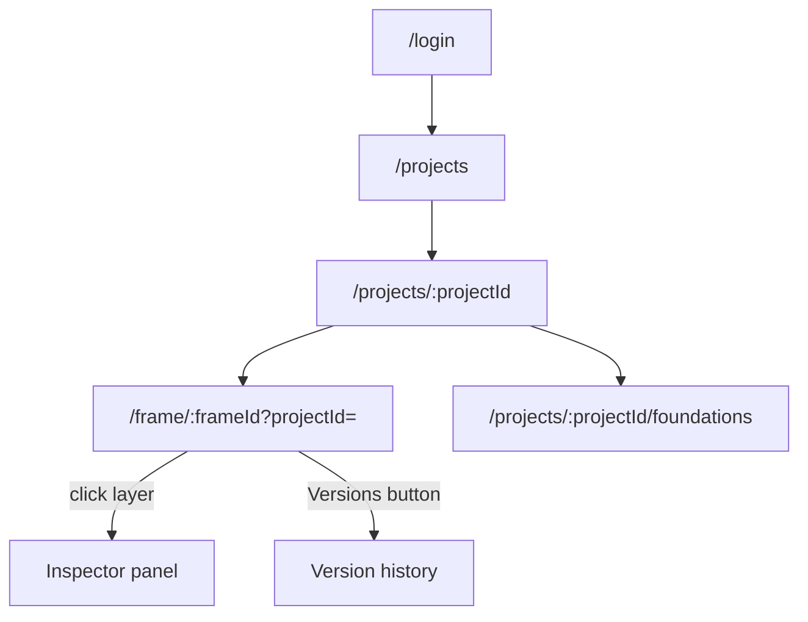
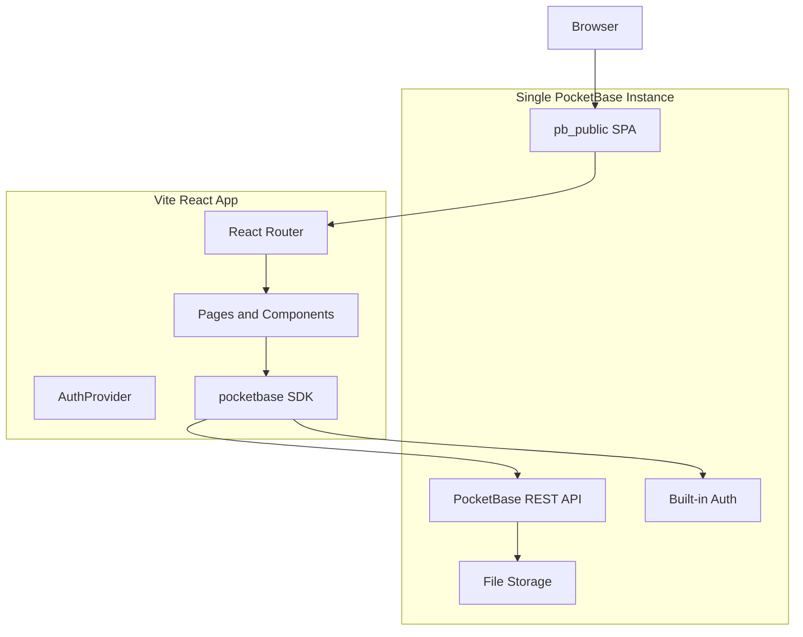
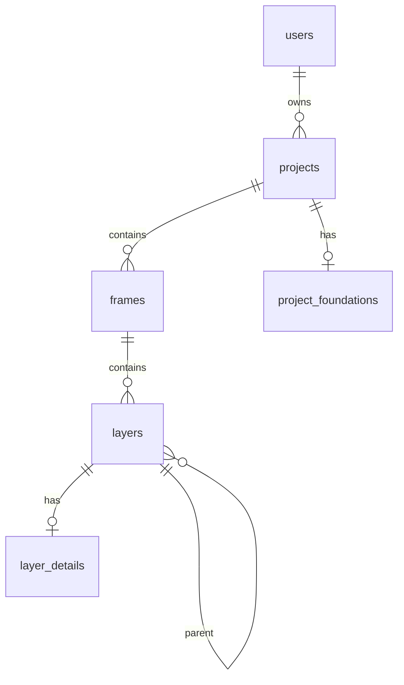
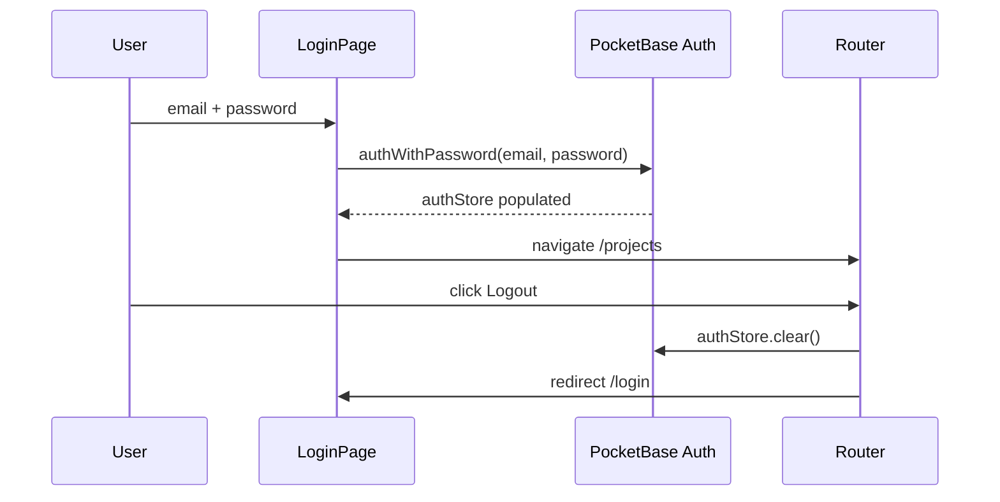

# Design Handoff — PocketBase + React Rebuild Plan (Self-Contained)

> **IMPORTANT:** The implementing agent will have **zero visibility** into any existing codebase. This document is the **only** source of truth. Do not look for or reference external files. All schemas, behavior specs, and code snippets are included here.

## 0. What You Are Building

**Design Handoff** is a design handoff tool (like Zeplin/Figma Inspect for the web). Designers sync Figma screens into the system; developers browse projects, open frames (screens), click layers on a canvas to inspect CSS/Tailwind/React properties, browse design tokens (variables/styles), and view frame version history when the same screen is re-synced.

### In scope
- Basic email/password login and logout (PocketBase built-in auth; users created in Admin UI)
- Projects list with create/edit/delete
- Frames list per project with create/edit/delete
- **Frame viewer** — interactive canvas with layer inspection (core feature)
- **Versioning** — implicit via duplicate frame names; version history sidebar
- **Foundations viewer** — Figma variables + styles browser
- **Search** — project/frame text search + layer filter + optional Ctrl+K command palette
- Single-origin hosting: React SPA built into PocketBase `pb_public/`

### Out of scope (do NOT build)
- User signup, OAuth, email verification, password reset
- Organizations, teams, invitations, RBAC
- Stripe billing, usage quotas
- API keys, Figma plugin bulk-upload API
- Marketing landing page
- Side-by-side version diff

### User flows



---

## 1. Product Behavior Specification

### 1.1 Projects page (`/projects`)
- Grid of cards (responsive: 1 col mobile, 2 col md, 3 col lg)
- Each card shows: thumbnail (first frame image or project thumbnail), name, Figma file link (if set), frame count, created date, updated date
- Hover reveals ⋮ menu: Edit, Delete
- "New Project" button opens dialog: fields `name` (required), `figma_file_url` (optional URL)
- Delete shows confirmation: "All frames and layers will also be deleted"
- Search input filters projects by name (PocketBase `~` contains filter)
- Empty state: "No projects found. Create your first project to get started." + Create button

### 1.2 Project detail page (`/projects/:projectId`)
- Header: project name, link to Foundations, back to projects
- Grid of frame cards (same responsive grid)
- Each frame card: thumbnail, name, dimensions (W×H), date, "View in Figma" link if `figma_url` set
- Click card → `/frame/:frameId?projectId=:projectId`
- ⋮ menu: View, Edit, Delete
- Edit dialog: `name`, `figma_url`
- Search input filters frames by name within project
- Shows **all** frame rows including duplicate names (multiple versions appear as separate cards)

### 1.3 Frame viewer (`/frame/:frameId?projectId=`) — CORE

**Layout:** Full-height flex column. Three zones: header bar, main area (version sidebar | canvas | inspector), mobile drawer.

**Header bar (sticky, h-14):**
- Back arrow → `/projects/:projectId`
- Frame name + Layers icon
- "Versions (N)" button (only if N > 1) — toggles version sidebar
- Zoom controls: − button, "NN%" label, + button (range 5%–500%, step 5%)
- "Figma" external link button if `figma_url` set

**Version sidebar (w-80, left, toggled):**
- Title "Version History" + close X
- List versions sorted newest-first
- Each version card: "Latest" badge on index 0; "Viewing" + checkmark on current; timestamp; "View" button; trash Delete button
- View navigates to that frame ID (same projectId query param)
- Delete removes that frame row (cascades layers); if deleting current frame → redirect to `/projects`

**Older-version banner (below header, above canvas):**
- Shown when viewing a non-latest version: "You're viewing an older version" + "View Latest" button

**Canvas area:**
- Background `bg-muted/30`
- Frame image centered with shadow, sized to frame width/height (default 800×600 if missing)
- Transform: `translate(panX, panY) scale(zoom)` with origin top-left
- Transparent clickable overlays on every layer (absolute positioned by x,y,width,height)
- **Click layer** → select it, show inspector
- **Click empty canvas** → deselect layer
- **Hover layer** → blue ring highlight; show padding overlays (red semi-transparent) if layer has padding in layer_details
- **Hover second layer while one selected** → red dashed SVG line between closest edges + distance tooltip in px
- **Right-click / context menu on overlapping layers** → popup list "Select Layer" with all layers at that point (name + type); hover item highlights layer yellow
- **Right-click drag when zoom > 1** → pan canvas (5px threshold before drag starts)
- **Mouse wheel when zoom > 1** → pan
- **Double-click TEXT layer** → copy text to clipboard (from layer name or typography.characters); toast success/error
- Zoom resets pan to 0,0 when zoom returns to 1

**Inspector panel (desktop: w-80 right sidebar; mobile: bottom drawer 70vh):**
- Shown when layer selected; header with layer name + close X
- Tabs: Layout | Style | Type (if typography exists) | Code
- Layout: position X/Y, dimensions W/H, padding T/R/B/L, margin T/R/B/L
- Style: background color swatch + hex, border radius/width/color, box shadow, opacity
- Type: font family, size, weight, line height, letter spacing, color swatch, text align
- Code: CSS, Tailwind, React blocks with Copy buttons

**Layer search (optional input above canvas or in sidebar):**
- Client-side filter of loaded layers by name or type

### 1.4 Versioning model (critical)

There is **no separate versions table**. Versioning works as follows:

1. Each sync of a Figma screen creates a **new `frames` row** with the same `name` but new `id`
2. All rows sharing `project` + `name` are versions of one screen
3. Sort by `updated` desc (fallback `created`) — index 0 is "Latest"
4. Frame list page shows all rows (duplicates visible)
5. Frame viewer nav deduplicates by name (keeps latest only) for frame switcher
6. Deleting a version deletes only that frame row + its layers (cascade)

### 1.5 Foundations page (`/projects/:projectId/foundations`)
- Loads single `project_foundations` record for project
- Top tabs: **Variables** | **Styles**
- Variables tab: accordion per collection; each variable shows name, type badge, value previews (color swatch, spacing bar, typography sample)
- Styles tab: sub-tabs Paint | Text | Effect | Grid; cards per style with visual previews
- Raw JSON in collapsible `<details>` per item
- Empty state if no foundation record

### 1.6 Search behaviors
| Location | Method |
|----------|--------|
| Projects page | PocketBase filter `name ~ "query"` |
| Frames page | PocketBase filter `project = "id" && name ~ "query"` |
| Frame viewer layers | Client filter on loaded layers |
| Global Ctrl+K | Command dialog searching projects + frames |

---

## 2. Target Architecture



**Why this stack works:** PocketBase serves the built React app from `pb_public/` on the same origin as the API, so the PocketBase JS SDK needs no CORS configuration and auth cookies work naturally.

---

## Recommended Project Structure

```
design-handoff-pocketbase/
├── pocketbase/                  # You manage: binary, data/, pb_migrations/
│   └── pb_public/               # Vite build output lands here
└── frontend/
    ├── src/
    │   ├── main.tsx
    │   ├── App.tsx
    │   ├── routes/              # React Router route modules
    │   ├── pages/               # Route-level page components
    │   ├── components/
    │   │   ├── ui/              # Port from components/ui/
    │   │   └── layout/          # Sidebar, header, nav
    │   ├── features/
    │   │   ├── frames/          # frame-viewer-page, inspector, frames-table
    │   │   ├── projects/        # projects-table, dialogs
    │   │   └── foundations/     # foundations-viewer
    │   ├── lib/
    │   │   ├── pocketbase.ts    # Singleton PB client
    │   │   ├── transforms.ts    # Copy verbatim from lib/transforms.ts
    │   │   ├── clipboard.ts
    │   │   └── types.ts         # Generated/hand-written Record types
    │   ├── hooks/
    │   │   ├── use-auth.ts
    │   │   └── use-mobile.ts
    │   └── providers/
    │       └── auth-provider.tsx
    ├── components.json          # shadcn config
    ├── vite.config.ts           # outDir → ../pocketbase/pb_public
    └── package.json
```

---

## PocketBase Collection Schema

Use PocketBase's built-in **`users`** auth collection for login. Create five custom collections below.

### 1. `projects`

| Field | Type | Options |
|-------|------|---------|
| `owner` | Relation | → `users`, single, required, cascade delete |
| `name` | Text | required, min 1 |
| `thumbnail` | File | optional, max 1, images only |
| `thumbnail_url` | URL | optional fallback when image is external |
| `figma_file_url` | URL | optional |
| `frame_count` | Number | default 0, no decimal |

**Indexes:** `owner`, `name`

**API rules (suggested):**
- List/View: `@request.auth.id != "" && owner = @request.auth.id`
- Create: `@request.auth.id != ""`
- Update/Delete: `owner = @request.auth.id`

---

### 2. `frames`

Each row is one version snapshot. Version groups = rows sharing `project` + `name`.

| Field | Type | Options |
|-------|------|---------|
| `project` | Relation | → `projects`, single, required, cascade delete |
| `name` | Text | required (version group key) |
| `width` | Number | optional |
| `height` | Number | optional |
| `thumbnail` | File | optional |
| `thumbnail_url` | URL | optional |
| `image` | File | optional, main frame render |
| `image_url` | URL | optional fallback (replaces current R2 URLs) |
| `figma_url` | URL | optional |
| `sort_order` | Number | optional |

**Indexes:** `project`, `name`, composite `(project, name)`, `updated` (desc)

**API rules:** inherit access via project owner:
```
@request.auth.id != "" && project.owner = @request.auth.id
```

---

### 3. `layers`

| Field | Type | Options |
|-------|------|---------|
| `frame` | Relation | → `frames`, single, required, cascade delete |
| `parent` | Relation | → `layers`, single, optional (self-ref) |
| `name` | Text | required |
| `type` | Select | required; values = all Figma node types listed in Section 5 types (`FIGMA_NODE_TYPES` array) |
| `x` | Number | optional |
| `y` | Number | optional |
| `width` | Number | optional |
| `height` | Number | optional |
| `clickable` | Bool | default true |
| `sort_order` | Number | optional |

**Indexes:** `frame`, `parent`, `name`

**Tip:** If importing from Figma plugin data with stable node IDs, enable **Allow custom ID** on this collection so IDs match upstream.

---

### 4. `layer_details`

| Field | Type | Options |
|-------|------|---------|
| `layer` | Relation | → `layers`, single, required, unique, cascade delete |
| `layout` | JSON | `{ padding?, margin? }` |
| `styles` | JSON | `{ backgroundColor?, borderRadius?, ... }` |
| `typography` | JSON | `{ fontFamily?, fontSize?, characters?, ... }` |
| `code` | JSON | `{ css?, tailwind?, react? }` |

**Indexes:** `layer` (unique enforced by field setting)

This mirrors the layer_detail JSON structure documented in Section 5.

---

### 5. `project_foundations`

| Field | Type | Options |
|-------|------|---------|
| `project` | Relation | → `projects`, single, required, unique, cascade delete |
| `data` | JSON | full Figma variables + styles export |
| `variables_count` | Number | default 0 |
| `styles_count` | Number | default 0 |

**Indexes:** `project` (unique)

---

### PocketBase API rules (copy into Admin UI)

```
# projects — List/View
@request.auth.id != "" && owner = @request.auth.id

# projects — Create
@request.auth.id != ""

# projects — Update/Delete
owner = @request.auth.id

# frames, layers, layer_details, project_foundations — all CRUD
@request.auth.id != "" && project.owner = @request.auth.id
# (for layers/layer_details, use: frame.project.owner = @request.auth.id)
```

For `layers` collection:
```
List/View/Create/Update/Delete: @request.auth.id != "" && frame.project.owner = @request.auth.id
```

For `layer_details` collection:
```
List/View/Create/Update/Delete: @request.auth.id != "" && layer.frame.project.owner = @request.auth.id
```

### PocketBase migration JSON — `pb_migrations/1700000001_specly_schema.js`

You can create this migration file so another agent (or you) can apply schema programmatically:

```javascript
migrate((app) => {
  // ── projects ──
  const projects = new Collection({
    name: "projects",
    type: "base",
    listRule: '@request.auth.id != "" && owner = @request.auth.id',
    viewRule: '@request.auth.id != "" && owner = @request.auth.id',
    createRule: '@request.auth.id != ""',
    updateRule: "owner = @request.auth.id",
    deleteRule: "owner = @request.auth.id",
    fields: [
      { name: "owner", type: "relation", required: true, collectionId: "_pb_users_auth_", maxSelect: 1, cascadeDelete: true },
      { name: "name", type: "text", required: true, min: 1 },
      { name: "thumbnail", type: "file", maxSelect: 1, maxSize: 10485760, mimeTypes: ["image/jpeg","image/png","image/webp","image/gif"] },
      { name: "thumbnail_url", type: "url" },
      { name: "figma_file_url", type: "url" },
      { name: "frame_count", type: "number", min: 0 },
    ],
    indexes: [
      "CREATE INDEX idx_projects_owner ON projects (owner)",
      "CREATE INDEX idx_projects_name ON projects (name)",
    ],
  });
  app.save(projects);

  // ── frames ──
  const frames = new Collection({
    name: "frames",
    type: "base",
    listRule: '@request.auth.id != "" && project.owner = @request.auth.id',
    viewRule: '@request.auth.id != "" && project.owner = @request.auth.id',
    createRule: '@request.auth.id != "" && project.owner = @request.auth.id',
    updateRule: "project.owner = @request.auth.id",
    deleteRule: "project.owner = @request.auth.id",
    fields: [
      { name: "project", type: "relation", required: true, collectionId: projects.id, maxSelect: 1, cascadeDelete: true },
      { name: "name", type: "text", required: true, min: 1 },
      { name: "width", type: "number" },
      { name: "height", type: "number" },
      { name: "thumbnail", type: "file", maxSelect: 1, maxSize: 10485760, mimeTypes: ["image/jpeg","image/png","image/webp","image/gif"] },
      { name: "thumbnail_url", type: "url" },
      { name: "image", type: "file", maxSelect: 1, maxSize: 10485760, mimeTypes: ["image/jpeg","image/png","image/webp","image/gif"] },
      { name: "image_url", type: "url" },
      { name: "figma_url", type: "url" },
      { name: "sort_order", type: "number" },
    ],
    indexes: [
      "CREATE INDEX idx_frames_project ON frames (project)",
      "CREATE INDEX idx_frames_name ON frames (name)",
      "CREATE INDEX idx_frames_project_name ON frames (project, name)",
    ],
  });
  app.save(frames);

  // ── layers (enable allowCustomId: true in Admin if importing Figma node IDs) ──
  const layers = new Collection({
    name: "layers",
    type: "base",
    listRule: '@request.auth.id != "" && frame.project.owner = @request.auth.id',
    viewRule: '@request.auth.id != "" && frame.project.owner = @request.auth.id',
    createRule: '@request.auth.id != "" && frame.project.owner = @request.auth.id',
    updateRule: "frame.project.owner = @request.auth.id",
    deleteRule: "frame.project.owner = @request.auth.id",
    fields: [
      { name: "frame", type: "relation", required: true, collectionId: frames.id, maxSelect: 1, cascadeDelete: true },
      { name: "parent", type: "relation", collectionId: "layers", maxSelect: 1 },
      { name: "name", type: "text", required: true },
      { name: "type", type: "select", required: true, maxSelect: 1, values: [
        "BOOLEAN_OPERATION","CODE_BLOCK","COMPONENT","COMPONENT_SET","CONNECTOR","DOCUMENT",
        "ELLIPSE","EMBED","FRAME","GROUP","HIGHLIGHT","INSTANCE","INTERACTIVE_SLIDE_ELEMENT",
        "LINE","LINK_UNFURL","MEDIA","PAGE","POLYGON","RECTANGLE","SECTION","SHAPE_WITH_TEXT",
        "SLICE","SLIDE","SLIDE_GRID","SLIDE_ROW","STAMP","STAR","STICKY","TABLE","TABLE_CELL",
        "TEXT","TEXT_PATH","TRANSFORM_GROUP","VECTOR","WASHI_TAPE","WIDGET"
      ]},
      { name: "x", type: "number" }, { name: "y", type: "number" },
      { name: "width", type: "number" }, { name: "height", type: "number" },
      { name: "clickable", type: "bool" },
      { name: "sort_order", type: "number" },
    ],
    indexes: [
      "CREATE INDEX idx_layers_frame ON layers (frame)",
      "CREATE INDEX idx_layers_parent ON layers (parent)",
    ],
  });
  app.save(layers);
  // Set parent relation to self after creation:
  layers.fields.getByName("parent").collectionId = layers.id;
  app.save(layers);

  // ── layer_details ──
  const layerDetails = new Collection({
    name: "layer_details",
    type: "base",
    listRule: '@request.auth.id != "" && layer.frame.project.owner = @request.auth.id',
    viewRule: '@request.auth.id != "" && layer.frame.project.owner = @request.auth.id',
    createRule: '@request.auth.id != "" && layer.frame.project.owner = @request.auth.id',
    updateRule: "layer.frame.project.owner = @request.auth.id",
    deleteRule: "layer.frame.project.owner = @request.auth.id",
    fields: [
      { name: "layer", type: "relation", required: true, collectionId: layers.id, maxSelect: 1, cascadeDelete: true },
      { name: "layout", type: "json" },
      { name: "styles", type: "json" },
      { name: "typography", type: "json" },
      { name: "code", type: "json" },
    ],
  });
  app.save(layerDetails);

  // ── project_foundations ──
  const foundations = new Collection({
    name: "project_foundations",
    type: "base",
    listRule: '@request.auth.id != "" && project.owner = @request.auth.id',
    viewRule: '@request.auth.id != "" && project.owner = @request.auth.id',
    createRule: '@request.auth.id != "" && project.owner = @request.auth.id',
    updateRule: "project.owner = @request.auth.id",
    deleteRule: "project.owner = @request.auth.id",
    fields: [
      { name: "project", type: "relation", required: true, collectionId: projects.id, maxSelect: 1, cascadeDelete: true },
      { name: "data", type: "json", required: true },
      { name: "variables_count", type: "number", min: 0 },
      { name: "styles_count", type: "number", min: 0 },
    ],
  });
  app.save(foundations);
}, (app) => {
  // rollback: delete collections in reverse order
  app.delete(app.findCollectionByNameOrId("project_foundations"));
  app.delete(app.findCollectionByNameOrId("layer_details"));
  app.delete(app.findCollectionByNameOrId("layers"));
  app.delete(app.findCollectionByNameOrId("frames"));
  app.delete(app.findCollectionByNameOrId("projects"));
});
```

---

### Schema diagram



---

Add shadcn/ui via CLI with **New York** style, **stone** base color, CSS variables enabled. Install these components:

```
button card tabs dialog alert-dialog dropdown-menu scroll-area drawer skeleton sidebar separator badge accordion command input label form toast sonner
```

---

## 3. Project Scaffold Commands

Run these in order to create the frontend:

```bash
# 1. Create Vite React TS project
npm create vite@latest frontend -- --template react-ts
cd frontend

# 2. Install dependencies
npm install react-router-dom pocketbase @tanstack/react-query date-fns sonner next-themes lucide-react class-variance-authority clsx tailwind-merge zod react-hook-form @hookform/resolvers

# 3. Install Tailwind v4 (follow tailwindcss.com Vite guide)
npm install tailwindcss @tailwindcss/vite

# 4. Init shadcn
npx shadcn@latest init
# Choose: New York, stone, CSS variables yes

# 5. Add components (run each or batch)
npx shadcn@latest add button card tabs dialog alert-dialog dropdown-menu scroll-area drawer skeleton sidebar separator badge accordion command input label form sonner

# 6. Create PocketBase folder structure alongside frontend
mkdir -p ../pocketbase/pb_public ../pocketbase/pb_migrations ../pocketbase/pb_hooks
```

### `frontend/package.json` scripts to add

```json
{
  "scripts": {
    "dev": "vite",
    "build": "tsc -b && vite build",
    "preview": "vite preview"
  }
}
```

### `frontend/components.json` (shadcn config)

```json
{
  "$schema": "https://ui.shadcn.com/schema.json",
  "style": "new-york",
  "rsc": false,
  "tsx": true,
  "tailwind": {
    "config": "",
    "css": "src/index.css",
    "baseColor": "stone",
    "cssVariables": true
  },
  "aliases": {
    "components": "@/components",
    "utils": "@/lib/utils",
    "ui": "@/components/ui",
    "lib": "@/lib",
    "hooks": "@/hooks"
  }
}
```

### `frontend/src/lib/utils.ts`

```typescript
import { clsx, type ClassValue } from "clsx";
import { twMerge } from "tailwind-merge";

export function cn(...inputs: ClassValue[]) {
  return twMerge(clsx(inputs));
}
```

### `frontend/src/hooks/use-mobile.ts`

```typescript
import * as React from "react";

const MOBILE_BREAKPOINT = 768;

export function useIsMobile() {
  const [isMobile, setIsMobile] = React.useState(false);

  React.useEffect(() => {
    const mql = window.matchMedia(`(max-width: ${MOBILE_BREAKPOINT - 1}px)`);
    const onChange = () => setIsMobile(window.innerWidth < MOBILE_BREAKPOINT);
    mql.addEventListener("change", onChange);
    setIsMobile(window.innerWidth < MOBILE_BREAKPOINT);
    return () => mql.removeEventListener("change", onChange);
  }, []);

  return isMobile;
}
```

### `frontend/src/lib/clipboard.ts`

```typescript
export async function copyToClipboard(text: string): Promise<boolean> {
  try {
    await navigator.clipboard.writeText(text);
    return true;
  } catch (error) {
    console.error("Failed to copy to clipboard:", error);
    return false;
  }
}
```

---

## 4. Sample Test Data (for manual PocketBase Admin seeding)

Use this to verify the viewer works. Create via Admin UI or REST API.

### Project record
```json
{
  "owner": "<your-user-id>",
  "name": "Demo App",
  "figma_file_url": "https://figma.com/file/example",
  "frame_count": 1
}
```

### Frame record
```json
{
  "project": "<project-id>",
  "name": "Login Screen",
  "width": 375,
  "height": 812,
  "image_url": "https://picsum.photos/375/812",
  "figma_url": "https://figma.com/file/example?node-id=1"
}
```

### Layer records (flat list — parent optional)
```json
[
  { "frame": "<frame-id>", "name": "Background", "type": "RECTANGLE", "x": 0, "y": 0, "width": 375, "height": 812, "sort_order": 1 },
  { "frame": "<frame-id>", "name": "Sign in", "type": "TEXT", "x": 40, "y": 200, "width": 200, "height": 40, "sort_order": 2 },
  { "frame": "<frame-id>", "name": "Submit Button", "type": "RECTANGLE", "x": 40, "y": 400, "width": 295, "height": 48, "sort_order": 3 }
]
```

### Layer detail for "Sign in" TEXT layer
```json
{
  "layer": "<text-layer-id>",
  "layout": { "padding": { "top": 0, "right": 0, "bottom": 0, "left": 0 } },
  "styles": {},
  "typography": {
    "fontFamily": "Inter",
    "fontSize": "32px",
    "fontWeight": "700",
    "lineHeight": "40px",
    "letterSpacing": "0px",
    "color": "#111827",
    "textAlign": "left",
    "characters": "Sign in"
  },
  "code": {
    "css": "font-family: Inter; font-size: 32px; font-weight: 700; color: #111827;",
    "tailwind": "text-[32px] font-bold text-gray-900",
    "react": "<span className=\"text-[32px] font-bold text-gray-900\">Sign in</span>"
  }
}
```

### Layer detail for "Submit Button" RECTANGLE
```json
{
  "layer": "<button-layer-id>",
  "layout": { "padding": { "top": 12, "right": 24, "bottom": 12, "left": 24 } },
  "styles": {
    "backgroundColor": "#2563eb",
    "borderRadius": "8px",
    "opacity": 1
  },
  "code": {
    "css": "background: #2563eb; border-radius: 8px; padding: 12px 24px;",
    "tailwind": "bg-blue-600 rounded-lg px-6 py-3",
    "react": "<button className=\"bg-blue-600 rounded-lg px-6 py-3\">Submit</button>"
  }
}
```

### Second frame (older version — same name for versioning test)
```json
{
  "project": "<project-id>",
  "name": "Login Screen",
  "width": 375,
  "height": 812,
  "image_url": "https://picsum.photos/375/813",
  "figma_url": "https://figma.com/file/example?node-id=1-old"
}
```
Create this with an earlier `created` timestamp (or wait and update the newer one) to test version sidebar.

### Project foundations record
```json
{
  "project": "<project-id>",
  "variables_count": 2,
  "styles_count": 1,
  "data": {
    "variables": {
      "collection1": {
        "id": "c1",
        "name": "Colors",
        "modes": [{ "modeId": "m1", "name": "Default" }],
        "variables": [
          { "id": "v1", "name": "primary/500", "type": "COLOR", "valuesByMode": { "m1": { "r": 37, "g": 99, "b": 235, "a": 1 } } },
          { "id": "v2", "name": "spacing/md", "type": "FLOAT", "valuesByMode": { "m1": 16 } }
        ]
      }
    },
    "styles": {
      "paint": [{ "id": "s1", "name": "Primary Fill", "type": "PAINT", "paints": [{ "type": "SOLID", "color": { "r": 37, "g": 99, "b": 235 } }] }],
      "text": [],
      "effect": [],
      "grid": []
    }
  }
}
```

---

## 5. Frontend Dependencies

```json
{
  "dependencies": {
    "react": "^19",
    "react-dom": "^19",
    "react-router-dom": "^7",
    "pocketbase": "^0.25",
    "@tanstack/react-query": "^5",
    "tailwindcss": "^4",
    "lucide-react": "^0.562",
    "date-fns": "^4",
    "sonner": "^2",
    "next-themes": "^0.4",
    "class-variance-authority": "^0.7",
    "clsx": "^2",
    "tailwind-merge": "^3"
  }
}
```

Add shadcn/ui via CLI (New York style, stone base — see Section 3). Install these components:

`button`, `card`, `tabs`, `dialog`, `alert-dialog`, `dropdown-menu`, `scroll-area`, `drawer`, `skeleton`, `sidebar`, `separator`, `badge`, `accordion`, `command`, `input`, `label`, `form`, `sonner`

---

## PocketBase SDK Layer

### Singleton client — `src/lib/pocketbase.ts`

```typescript
import PocketBase from "pocketbase";

export const pb = new PocketBase(import.meta.env.VITE_POCKETBASE_URL ?? "/");

// Persist auth across reloads
pb.authStore.loadFromCookie(document.cookie);
pb.authStore.onChange(() => {
  document.cookie = pb.authStore.exportToCookie({ httpOnly: false });
});
```

When hosted inside `pb_public/`, `VITE_POCKETBASE_URL` can be empty string or `/` (same origin).

### API service module — `src/lib/api/index.ts`

Full implementation is in the **Reference Code Snippets** section below. Exported functions:

| Function | Purpose |
|----------|---------|
| `getUserProjects()` | List projects for logged-in owner |
| `getUserProjectById(id)` | Single project |
| `createUserProject(data)` | Create project |
| `updateUserProject(data)` | Update project |
| `deleteUserProject(id)` | Delete project (cascades frames) |
| `getFrame(frameId)` | Single frame |
| `getProjectFrames(projectId)` | All frames in project |
| `getFramesByName(projectId, name)` | All versions of a screen |
| `deleteFrame(id)` | Delete one frame version |
| `getLayersByFrame(frameId)` | All layers for frame |
| `getLayer(layerId)` | Single layer |
| `getLayerDetails(layerId)` | Single layer_detail |
| `getLayerPaddingMap(layerIds)` | Batch padding lookup |
| `getUserProjectFoundation(projectId)` | Foundations JSON |

Wrap calls in TanStack Query hooks — full hook code is in Reference Code Snippets.

### File URL helper

```typescript
// src/lib/files.ts
import { pb } from "./pocketbase";
import type { Frame, Project } from "./types";

export function fileUrl(
  record: { id: string; collectionId: string },
  field: string
): string {
  return pb.files.getUrl(record, field);
}

/** Resolve frame image — prefer external URL, fall back to PocketBase file field */
export function frameImageSrc(frame: Frame): string {
  if (frame.image_url) return frame.image_url;
  if (frame.image) return fileUrl(frame, "image");
  if (frame.thumbnail_url) return frame.thumbnail_url;
  if (frame.thumbnail) return fileUrl(frame, "thumbnail");
  return "/placeholder.svg";
}

/** Same pattern for project thumbnails */
export function projectThumbnailSrc(project: Project): string | undefined {
  if (project.thumbnail_url) return project.thumbnail_url;
  if (project.thumbnail) return fileUrl(project, "thumbnail");
  return undefined;
}
```

### PocketBase filter escaping (required for search + versioning)

```typescript
// src/lib/pb-filter.ts
/** Escape user input for PocketBase filter strings */
export function escapeFilterValue(value: string): string {
  return value.replace(/\\/g, "\\\\").replace(/"/g, '\\"');
}

export function projectFilter(projectId: string): string {
  return `project = "${escapeFilterValue(projectId)}"`;
}

export function framesByNameFilter(projectId: string, name: string): string {
  return `project = "${escapeFilterValue(projectId)}" && name = "${escapeFilterValue(name)}"`;
}

export function framesSearchFilter(projectId: string, query: string): string {
  return `project = "${escapeFilterValue(projectId)}" && name ~ "${escapeFilterValue(query)}"`;
}
```

---

## Reference Code Snippets (Copy-Paste Ready)

The snippets below contain **all code** needed for the data layer, auth, and core components. An implementing agent should create these files exactly as written.

### TypeScript types — `src/lib/types.ts`

```typescript
import type { RecordModel } from "pocketbase";

export const FIGMA_NODE_TYPES = [
  "BOOLEAN_OPERATION", "CODE_BLOCK", "COMPONENT", "COMPONENT_SET", "CONNECTOR",
  "DOCUMENT", "ELLIPSE", "EMBED", "FRAME", "GROUP", "HIGHLIGHT", "INSTANCE",
  "INTERACTIVE_SLIDE_ELEMENT", "LINE", "LINK_UNFURL", "MEDIA", "PAGE",
  "POLYGON", "RECTANGLE", "SECTION", "SHAPE_WITH_TEXT", "SLICE", "SLIDE",
  "SLIDE_GRID", "SLIDE_ROW", "STAMP", "STAR", "STICKY", "TABLE", "TABLE_CELL",
  "TEXT", "TEXT_PATH", "TRANSFORM_GROUP", "VECTOR", "WASHI_TAPE", "WIDGET",
] as const;

export type LayerType = (typeof FIGMA_NODE_TYPES)[number];

export interface Project extends RecordModel {
  owner: string;
  name: string;
  thumbnail?: string;
  thumbnail_url?: string;
  figma_file_url?: string;
  frame_count: number;
}

export interface Frame extends RecordModel {
  project: string;
  name: string;
  width?: number;
  height?: number;
  thumbnail?: string;
  thumbnail_url?: string;
  image?: string;
  image_url?: string;
  figma_url?: string;
  sort_order?: number;
}

export interface Layer extends RecordModel {
  frame: string;
  parent?: string;
  name: string;
  type: LayerType;
  x?: number;
  y?: number;
  width?: number;
  height?: number;
  clickable?: boolean;
  sort_order?: number;
}

export interface LayerDetail extends RecordModel {
  layer: string;
  layout?: {
    padding?: { top: number; right: number; bottom: number; left: number };
    margin?: { top: number; right: number; bottom: number; left: number };
  };
  styles?: {
    backgroundColor?: string;
    borderRadius?: string;
    borderWidth?: string;
    borderColor?: string;
    boxShadow?: string;
    opacity?: number;
  };
  typography?: {
    fontFamily?: string;
    fontSize?: string;
    fontWeight?: string | number;
    lineHeight?: string;
    letterSpacing?: string;
    color?: string;
    textAlign?: string;
    characters?: string;
    text?: string;
    content?: string;
    value?: string;
  };
  code?: { css?: string; tailwind?: string; react?: string };
}

export interface ProjectFoundation extends RecordModel {
  project: string;
  data: FoundationsData;
  variables_count: number;
  styles_count: number;
}

// Re-export from foundations-viewer.tsx — copy FoundationsData type unchanged
export type FoundationsData = {
  variables?: Record<string, {
    id: string; name: string;
    modes: Array<{ modeId: string; name: string }>;
    variables: Array<{ id: string; name: string; type: string; description?: string; scopes?: string[]; codeSyntax?: Record<string, string>; valuesByMode?: Record<string, unknown> }>;
  }>;
  styles?: {
    paint?: Array<{ id: string; name: string; description?: string; type: string; paints?: unknown[] }>;
    text?: Array<{ id: string; name: string; description?: string; type: string; fontName?: { family?: string; style?: string }; fontSize?: number; fontWeight?: number; lineHeight?: { value?: number; unit?: string }; letterSpacing?: { value?: number; unit?: string }; textDecoration?: string; paragraphIndent?: number; paragraphSpacing?: number; textCase?: string }>;
    effect?: Array<{ id: string; name: string; description?: string; type: string; effects?: unknown[] }>;
    grid?: Array<{ id: string; name: string; description?: string; type: string; layoutGrids?: unknown[] }>;
  };
};
```

### Complete `src/lib/transforms.ts`

```typescript
import type { Layer, LayerDetail } from "./types";

export type TransformedLayerDetail = {
  layout: {
    position: { x: number; y: number };
    dimensions: { width: number; height: number };
    padding?: { top: number; right: number; bottom: number; left: number };
    margin?: { top: number; right: number; bottom: number; left: number };
  };
  styles: {
    backgroundColor?: string;
    borderRadius?: string;
    borderWidth?: string;
    borderColor?: string;
    boxShadow?: string;
    opacity?: number;
  };
  typography?: {
    fontFamily: string;
    fontSize: string;
    fontWeight: string | number;
    lineHeight: string;
    letterSpacing: string;
    color: string;
    textAlign: string;
  };
  code: { css: string; tailwind: string; react: string };
};

export function transformLayerDetail(
  layer: Layer | null,
  layerDetail: LayerDetail | null
): TransformedLayerDetail | null {
  if (!layer) return null;

  const layoutData = layerDetail?.layout || {};
  const stylesData = layerDetail?.styles || {};
  const typographyData = layerDetail?.typography || {};
  const codeData = layerDetail?.code || {};

  return {
    layout: {
      position: { x: layer.x || 0, y: layer.y || 0 },
      dimensions: { width: layer.width || 0, height: layer.height || 0 },
      padding: layoutData.padding
        ? {
            top: layoutData.padding.top || 0,
            right: layoutData.padding.right || 0,
            bottom: layoutData.padding.bottom || 0,
            left: layoutData.padding.left || 0,
          }
        : undefined,
      margin: layoutData.margin
        ? {
            top: layoutData.margin.top || 0,
            right: layoutData.margin.right || 0,
            bottom: layoutData.margin.bottom || 0,
            left: layoutData.margin.left || 0,
          }
        : undefined,
    },
    styles: {
      backgroundColor: stylesData.backgroundColor,
      borderRadius: stylesData.borderRadius,
      borderWidth: stylesData.borderWidth,
      borderColor: stylesData.borderColor,
      boxShadow: stylesData.boxShadow,
      opacity: stylesData.opacity,
    },
    typography: typographyData.fontFamily
      ? {
          fontFamily: typographyData.fontFamily || "",
          fontSize: typographyData.fontSize || "",
          fontWeight: typographyData.fontWeight || "",
          lineHeight: typographyData.lineHeight || "",
          letterSpacing: typographyData.letterSpacing || "",
          color: typographyData.color || "",
          textAlign: typographyData.textAlign || "",
        }
      : undefined,
    code: {
      css: codeData.css || "",
      tailwind: codeData.tailwind || "",
      react: codeData.react || "",
    },
  };
}
```

### API layer — `src/lib/api/index.ts`

```typescript
import { pb } from "../pocketbase";
import { framesByNameFilter, projectFilter, escapeFilterValue } from "../pb-filter";
import type { Frame, Layer, LayerDetail, Project, ProjectFoundation } from "../types";

// ─── Projects ───────────────────────────────────────────────
export async function getUserProjects(): Promise<Project[]> {
  if (!pb.authStore.isValid) return [];
  return pb.collection("projects").getFullList<Project>({
    filter: `owner = "${pb.authStore.record!.id}"`,
    sort: "-updated",
  });
}

export async function getUserProjectById(id: string): Promise<Project> {
  return pb.collection("projects").getOne<Project>(id);
}

export async function createUserProject(data: {
  name?: string; thumbnail_url?: string; figma_file_url?: string; frame_count?: number;
}): Promise<Project> {
  return pb.collection("projects").create<Project>({
    owner: pb.authStore.record!.id,
    name: data.name ?? "Untitled",
    thumbnail_url: data.thumbnail_url,
    figma_file_url: data.figma_file_url,
    frame_count: data.frame_count ?? 0,
  });
}

export async function updateUserProject(data: {
  id: string; name?: string; thumbnail_url?: string; figma_file_url?: string; frame_count?: number;
}): Promise<Project> {
  return pb.collection("projects").update<Project>(data.id, {
    name: data.name,
    thumbnail_url: data.thumbnail_url,
    figma_file_url: data.figma_file_url,
    frame_count: data.frame_count,
  });
}

export async function deleteUserProject(id: string): Promise<boolean> {
  try {
    await pb.collection("projects").delete(id);
    return true;
  } catch {
    return false;
  }
}

// ─── Frames ─────────────────────────────────────────────────
export async function getFrame(frameId: string): Promise<Frame | null> {
  try {
    return await pb.collection("frames").getOne<Frame>(frameId);
  } catch {
    return null;
  }
}

export async function getProjectFrames(projectId: string): Promise<Frame[]> {
  return pb.collection("frames").getFullList<Frame>({
    filter: projectFilter(projectId),
    sort: "-updated,-created",
  });
}

/** Fetch all versions of a screen (same project + name) */
export async function getFramesByName(projectId: string, name: string): Promise<Frame[]> {
  return pb.collection("frames").getFullList<Frame>({
    filter: framesByNameFilter(projectId, name),
    sort: "-updated,-created",
  });
}

export async function deleteFrame(id: string): Promise<boolean> {
  try {
    await pb.collection("frames").delete(id);
    return true;
  } catch (error) {
    console.error("Error deleting frame:", error);
    return false;
  }
}

// ─── Layers ─────────────────────────────────────────────────
export async function getLayersByFrame(frameId: string): Promise<Layer[]> {
  return pb.collection("layers").getFullList<Layer>({
    filter: `frame = "${escapeFilterValue(frameId)}"`,
    sort: "sort_order",
  });
}

export async function getLayer(layerId: string): Promise<Layer | null> {
  try {
    return await pb.collection("layers").getOne<Layer>(layerId);
  } catch {
    return null;
  }
}

// ─── Layer Details ──────────────────────────────────────────
export async function getLayerDetails(layerId: string): Promise<LayerDetail | null> {
  try {
    return await pb.collection("layer_details").getFirstListItem<LayerDetail>(
      `layer = "${escapeFilterValue(layerId)}"`
    );
  } catch {
    return null;
  }
}

/** Batch-fetch padding map — replaces N+1 loop in frame/[frameId]/page.tsx */
export async function getLayerPaddingMap(
  layerIds: string[]
): Promise<Record<string, { padding?: { top: number; right: number; bottom: number; left: number } }>> {
  if (layerIds.length === 0) return {};
  const filter = layerIds.map((id) => `layer = "${escapeFilterValue(id)}"`).join(" || ");
  const details = await pb.collection("layer_details").getFullList<LayerDetail>({ filter });
  const map: Record<string, { padding?: { top: number; right: number; bottom: number; left: number } }> = {};
  for (const d of details) {
    if (d.layout?.padding) map[d.layer] = { padding: d.layout.padding };
  }
  return map;
}

// ─── Foundations ────────────────────────────────────────────
export async function getUserProjectFoundation(projectId: string): Promise<ProjectFoundation | null> {
  try {
    return await pb.collection("project_foundations").getFirstListItem<ProjectFoundation>(
      projectFilter(projectId)
    );
  } catch {
    return null;
  }
}
```

### Versioning + dedup utilities — `src/lib/frame-utils.ts`

```typescript
import type { Frame } from "./types";

/** Sort versions newest-first — matches current updatedAt || createdAt logic */
export function sortFramesByDateDesc(frames: Frame[]): Frame[] {
  return [...frames].sort((a, b) => {
    const dateA = new Date(a.updated || a.created);
    const dateB = new Date(b.updated || b.created);
    return dateB.getTime() - dateA.getTime();
  });
}

/** Group by name, keep latest — used for frame switcher nav */
export function dedupeLatestFrames(frames: Frame[]): Frame[] {
  const frameMap = new Map<string, Frame>();
  for (const f of frames) {
    const existing = frameMap.get(f.name);
    if (!existing) {
      frameMap.set(f.name, f);
    } else {
      const existingDate = new Date(existing.updated || existing.created);
      const currentDate = new Date(f.updated || f.created);
      if (currentDate > existingDate) frameMap.set(f.name, f);
    }
  }
  return sortFramesByDateDesc([...frameMap.values()]);
}

export function isViewingOlderVersion(frameId: string, versions: Frame[]): boolean {
  return versions.length > 1 && versions[0]?.id !== frameId;
}
```

### TanStack Query hooks — `src/hooks/queries.ts`

```typescript
import { useQuery, useMutation, useQueryClient } from "@tanstack/react-query";
import {
  getUserProjects, getProjectFrames, getFrame, getLayersByFrame,
  getFramesByName, getLayerPaddingMap, getLayer, getLayerDetails,
  deleteFrame, deleteUserProject, getUserProjectFoundation,
} from "../lib/api";
import { sortFramesByDateDesc, dedupeLatestFrames } from "../lib/frame-utils";

export function useProjects() {
  return useQuery({ queryKey: ["projects"], queryFn: getUserProjects });
}

export function useProjectFrames(projectId: string) {
  return useQuery({
    queryKey: ["frames", projectId],
    queryFn: () => getProjectFrames(projectId),
    enabled: !!projectId,
  });
}

export function useFrame(frameId?: string) {
  return useQuery({
    queryKey: ["frame", frameId],
    queryFn: () => getFrame(frameId!),
    enabled: !!frameId,
  });
}

export function useLayers(frameId?: string) {
  return useQuery({
    queryKey: ["layers", frameId],
    queryFn: () => getLayersByFrame(frameId!),
    enabled: !!frameId,
  });
}

export function useFrameVersions(projectId?: string, frameName?: string) {
  return useQuery({
    queryKey: ["frame-versions", projectId, frameName],
    queryFn: async () => sortFramesByDateDesc(await getFramesByName(projectId!, frameName!)),
    enabled: !!projectId && !!frameName,
  });
}

export function useLatestFramesByProject(projectId?: string) {
  return useQuery({
    queryKey: ["frames-latest", projectId],
    queryFn: async () => dedupeLatestFrames(await getProjectFrames(projectId!)),
    enabled: !!projectId,
  });
}

export function useLayerPaddingMap(layerIds: string[]) {
  return useQuery({
    queryKey: ["layer-padding", layerIds],
    queryFn: () => getLayerPaddingMap(layerIds),
    enabled: layerIds.length > 0,
  });
}

/** Used by Inspector — replaces server action calls */
export function useLayerInspector(layerId?: string) {
  return useQuery({
    queryKey: ["layer-inspector", layerId],
    queryFn: async () => {
      const [layer, detail] = await Promise.all([getLayer(layerId!), getLayerDetails(layerId!)]);
      return { layer, detail };
    },
    enabled: !!layerId,
  });
}

export function useDeleteFrame() {
  const qc = useQueryClient();
  return useMutation({
    mutationFn: deleteFrame,
    onSuccess: () => {
      qc.invalidateQueries({ queryKey: ["frames"] });
      qc.invalidateQueries({ queryKey: ["frame-versions"] });
    },
  });
}

export function useProjectFoundation(projectId: string) {
  return useQuery({
    queryKey: ["foundation", projectId],
    queryFn: () => getUserProjectFoundation(projectId),
    enabled: !!projectId,
  });
}
```

### Frame viewer page loader — `src/pages/frame-viewer.tsx`

```typescript
import { useParams, useSearchParams } from "react-router-dom";
import FrameViewerPage from "../features/frames/components/frame-viewer-page";
import {
  useFrame, useLayers, useFrameVersions, useLatestFramesByProject, useLayerPaddingMap,
} from "../hooks/queries";

export default function FrameViewerRoute() {
  const { frameId } = useParams<{ frameId: string }>();
  const [searchParams] = useSearchParams();
  const projectId = searchParams.get("projectId") ?? "";

  const { data: frame, isLoading: frameLoading } = useFrame(frameId);
  const { data: layers = [] } = useLayers(frameId);
  const { data: frameVersions = [] } = useFrameVersions(projectId, frame?.name);
  const { data: allFrames = [] } = useLatestFramesByProject(projectId);
  const layerIds = layers.map((l) => l.id);
  const { data: layerDetailsMap = {} } = useLayerPaddingMap(layerIds);

  if (frameLoading) return <div className="p-8 text-muted-foreground">Loading frame…</div>;
  if (!frame) return <div className="p-8 text-muted-foreground">Frame not found</div>;

  return (
    <FrameViewerPage
      frame={{ ...frame, layers }}
      frameId={frameId!}
      projectId={projectId}
      layerDetailsMap={layerDetailsMap}
      frameVersions={frameVersions}
      allFrames={allFrames}
    />
  );
}
```

### Complete `src/features/frames/components/inspector.tsx`

```typescript
import { useMemo } from "react";
import { Copy, Check } from "lucide-react";
import { Tabs, TabsContent, TabsList, TabsTrigger } from "@/components/ui/tabs";
import { Button } from "@/components/ui/button";
import { Skeleton } from "@/components/ui/skeleton";
import { useLayerInspector } from "@/hooks/queries";
import { transformLayerDetail, type TransformedLayerDetail } from "@/lib/transforms";
import { copyToClipboard } from "@/lib/clipboard";
import { useState } from "react";

export function Inspector({ layerId }: { layerId: string }) {
  const { data, isLoading } = useLayerInspector(layerId);
  const layer = useMemo(
    () => (data?.layer ? transformLayerDetail(data.layer, data.detail) : null),
    [data]
  );

  if (isLoading) {
    return (
      <div className="p-4 space-y-4">
        <Skeleton className="h-8 w-full" />
        <Skeleton className="h-32 w-full" />
        <Skeleton className="h-32 w-full" />
      </div>
    );
  }
  if (!layer) return null;

  return (
    <Tabs defaultValue="layout" className="w-full min-w-0">
      <TabsList className="w-full justify-start border-b border-border rounded-none px-4 h-10 bg-transparent overflow-x-auto">
        <TabsTrigger value="layout" className="text-xs shrink-0">Layout</TabsTrigger>
        <TabsTrigger value="style" className="text-xs shrink-0">Style</TabsTrigger>
        {layer.typography && <TabsTrigger value="typography" className="text-xs shrink-0">Type</TabsTrigger>}
        <TabsTrigger value="code" className="text-xs shrink-0">Code</TabsTrigger>
      </TabsList>
      <TabsContent value="layout" className="p-4 space-y-4 mt-0"><LayoutTab layer={layer} /></TabsContent>
      <TabsContent value="style" className="p-4 space-y-4 mt-0"><StyleTab layer={layer} /></TabsContent>
      {layer.typography && (
        <TabsContent value="typography" className="p-4 space-y-4 mt-0"><TypographyTab typography={layer.typography} /></TabsContent>
      )}
      <TabsContent value="code" className="p-4 space-y-4 mt-0"><CodeTab code={layer.code} /></TabsContent>
    </Tabs>
  );
}

function LayoutTab({ layer }: { layer: TransformedLayerDetail }) {
  return (
    <div className="space-y-4">
      <Section title="Position">
        <div className="grid grid-cols-2 gap-2">
          <PropertyItem label="X" value={`${layer.layout.position.x}px`} />
          <PropertyItem label="Y" value={`${layer.layout.position.y}px`} />
        </div>
      </Section>
      <Section title="Dimensions">
        <div className="grid grid-cols-2 gap-2">
          <PropertyItem label="W" value={`${layer.layout.dimensions.width}px`} />
          <PropertyItem label="H" value={`${layer.layout.dimensions.height}px`} />
        </div>
      </Section>
      {layer.layout.padding && (
        <Section title="Padding">
          <div className="grid grid-cols-4 gap-2">
            <PropertyItem label="T" value={`${layer.layout.padding.top}`} />
            <PropertyItem label="R" value={`${layer.layout.padding.right}`} />
            <PropertyItem label="B" value={`${layer.layout.padding.bottom}`} />
            <PropertyItem label="L" value={`${layer.layout.padding.left}`} />
          </div>
        </Section>
      )}
      {layer.layout.margin && (
        <Section title="Margin">
          <div className="grid grid-cols-4 gap-2">
            <PropertyItem label="T" value={`${layer.layout.margin.top}`} />
            <PropertyItem label="R" value={`${layer.layout.margin.right}`} />
            <PropertyItem label="B" value={`${layer.layout.margin.bottom}`} />
            <PropertyItem label="L" value={`${layer.layout.margin.left}`} />
          </div>
        </Section>
      )}
    </div>
  );
}

function StyleTab({ layer }: { layer: TransformedLayerDetail }) {
  return (
    <div className="space-y-4">
      {layer.styles.backgroundColor && (
        <Section title="Background">
          <div className="flex items-center gap-2">
            <div className="h-8 w-8 rounded border border-border" style={{ backgroundColor: layer.styles.backgroundColor }} />
            <span className="text-sm font-mono">{layer.styles.backgroundColor}</span>
          </div>
        </Section>
      )}
      {layer.styles.borderRadius && layer.styles.borderRadius !== "0px" && (
        <PropertyItem label="Border Radius" value={layer.styles.borderRadius} />
      )}
      {layer.styles.borderWidth && layer.styles.borderWidth !== "0px" && (
        <div className="space-y-2">
          <PropertyItem label="Border Width" value={layer.styles.borderWidth} />
          {layer.styles.borderColor && (
            <div className="flex items-center gap-2">
              <span className="text-xs text-muted-foreground">Color</span>
              <div className="h-4 w-4 rounded border border-border" style={{ backgroundColor: layer.styles.borderColor }} />
              <span className="text-sm font-mono">{layer.styles.borderColor}</span>
            </div>
          )}
        </div>
      )}
      {layer.styles.boxShadow && <PropertyItem label="Box Shadow" value={layer.styles.boxShadow} />}
      {layer.styles.opacity !== undefined && layer.styles.opacity !== 1 && (
        <PropertyItem label="Opacity" value={`${layer.styles.opacity * 100}%`} />
      )}
    </div>
  );
}

function TypographyTab({ typography }: { typography: NonNullable<TransformedLayerDetail["typography"]> }) {
  return (
    <div className="space-y-4">
      <PropertyItem label="Font Family" value={typography.fontFamily} />
      <div className="grid grid-cols-2 gap-2">
        <PropertyItem label="Size" value={typography.fontSize} />
        <PropertyItem label="Weight" value={String(typography.fontWeight)} />
      </div>
      <div className="grid grid-cols-2 gap-2">
        <PropertyItem label="Line Height" value={typography.lineHeight} />
        <PropertyItem label="Letter Spacing" value={typography.letterSpacing} />
      </div>
      <Section title="Color">
        <div className="flex items-center gap-2">
          <div className="h-6 w-6 rounded border border-border" style={{ backgroundColor: typography.color }} />
          <span className="text-sm font-mono">{typography.color}</span>
        </div>
      </Section>
      <PropertyItem label="Text Align" value={typography.textAlign} />
    </div>
  );
}

function CodeTab({ code }: { code: TransformedLayerDetail["code"] }) {
  const [copied, setCopied] = useState<string | null>(null);
  const handleCopy = async (text: string, type: string) => {
    if (await copyToClipboard(text)) { setCopied(type); setTimeout(() => setCopied(null), 2000); }
  };
  return (
    <div className="space-y-4">
      <CodeBlock label="CSS" code={code.css} copied={copied === "css"} onCopy={() => handleCopy(code.css, "css")} />
      <CodeBlock label="Tailwind" code={code.tailwind} copied={copied === "tailwind"} onCopy={() => handleCopy(code.tailwind, "tailwind")} />
      <CodeBlock label="React (inline)" code={code.react} copied={copied === "react"} onCopy={() => handleCopy(code.react, "react")} />
    </div>
  );
}

function Section({ title, children }: { title: string; children: React.ReactNode }) {
  return (
    <div>
      <h4 className="text-xs font-medium text-muted-foreground mb-2">{title}</h4>
      {children}
    </div>
  );
}

function PropertyItem({ label, value }: { label: string; value: string }) {
  return (
    <div className="flex items-center justify-between rounded-md bg-muted/50 px-3 py-2">
      <span className="text-xs text-muted-foreground">{label}</span>
      <span className="text-sm font-mono">{value}</span>
    </div>
  );
}

function CodeBlock({ label, code, copied, onCopy }: { label: string; code: string; copied: boolean; onCopy: () => void }) {
  return (
    <div>
      <div className="flex items-center justify-between mb-2">
        <h4 className="text-xs font-medium text-muted-foreground">{label}</h4>
        <Button variant="ghost" size="sm" className="h-7 gap-1.5 text-xs" onClick={onCopy}>
          {copied ? (<><Check className="h-3 w-3" />Copied</>) : (<><Copy className="h-3 w-3" />Copy</>)}
        </Button>
      </div>
      <pre className="overflow-x-auto rounded-lg bg-muted p-3 text-xs font-mono max-w-full">{code}</pre>
    </div>
  );
}
```

### Core canvas algorithms — implement in `frame-viewer-page.tsx`

These functions define inspect behavior. Implement exactly as specified in Section 1.3:

```typescript
// 1. flattenLayers — builds tree from parent relation, then depth-first flatten
function flattenLayers(layers: Layer[]): Layer[] {
  const layerMap = new Map<string, Layer & { children?: Layer[] }>();
  const rootLayers: (Layer & { children?: Layer[] })[] = [];
  layers.forEach((layer) => layerMap.set(layer.id, { ...layer }));
  layers.forEach((layer) => {
    const node = layerMap.get(layer.id)!;
    if (layer.parent) {
      const parent = layerMap.get(layer.parent);
      if (parent) {
        if (!parent.children) parent.children = [];
        parent.children.push(node);
      }
    } else {
      rootLayers.push(node);
    }
  });
  const flatten = (nodes: (Layer & { children?: Layer[] })[]): Layer[] =>
    nodes.reduce<Layer[]>((acc, n) => {
      acc.push(n);
      if (n.children) acc.push(...flatten(n.children));
      return acc;
    }, []);
  return flatten(rootLayers);
}

// 2. findLayersAtPoint — bounding-box hit test (lines 164-178)
function findLayersAtPoint(frameX: number, frameY: number, allLayers: Layer[]): Layer[] {
  return allLayers.filter((layer) => {
    const x = layer.x || 0, y = layer.y || 0;
    const w = layer.width || 0, h = layer.height || 0;
    return frameX >= x && frameX <= x + w && frameY >= y && frameY <= y + h;
  });
}

// 3. screenToFrameCoordinates — undo pan + zoom transform (lines 181-200)
function screenToFrameCoordinates(
  screenX: number, screenY: number, containerElement: HTMLElement,
  panX: number, panY: number, zoom: number
): { x: number; y: number } | null {
  const frameContainer = containerElement.querySelector('[style*="transform"]') as HTMLElement;
  if (!frameContainer) return null;
  const rect = frameContainer.getBoundingClientRect();
  return {
    x: (screenX - rect.left - panX) / zoom,
    y: (screenY - rect.top - panY) / zoom,
  };
}

// 4. Zoom limits — handleZoomIn/Out (lines 555-561)
// Min 0.05 (5%), max 5 (500%), step 0.05
// Reset pan when zoom === 1 (useEffect lines 79-84)

// 5. calculateDistance — full implementation (edge-to-edge px measurement)
function calculateDistance(layer1: Layer, layer2: Layer) {
  const x1 = layer1.x || 0, y1 = layer1.y || 0, w1 = layer1.width || 0, h1 = layer1.height || 0;
  const right1 = x1 + w1, bottom1 = y1 + h1;
  const x2 = layer2.x || 0, y2 = layer2.y || 0, w2 = layer2.width || 0, h2 = layer2.height || 0;
  const right2 = x2 + w2, bottom2 = y2 + h2;
  const gapX = Math.max(0, Math.max(x1, x2) - Math.min(right1, right2));
  const gapY = Math.max(0, Math.max(y1, y2) - Math.min(bottom1, bottom2));
  let point1X: number, point1Y: number, point2X: number, point2Y: number;

  if (gapX === 0 && gapY === 0) {
    point1X = x1 + w1 / 2; point1Y = y1 + h1 / 2;
    point2X = x2 + w2 / 2; point2Y = y2 + h2 / 2;
  } else if (gapX === 0) {
    const centerX = (Math.min(right1, right2) + Math.max(x1, x2)) / 2;
    if (y1 + h1 <= y2) { point1X = centerX; point1Y = bottom1; point2X = centerX; point2Y = y2; }
    else { point1X = centerX; point1Y = y1; point2X = centerX; point2Y = bottom2; }
  } else if (gapY === 0) {
    const centerY = (Math.min(bottom1, bottom2) + Math.max(y1, y2)) / 2;
    if (x1 + w1 <= x2) { point1X = right1; point1Y = centerY; point2X = x2; point2Y = centerY; }
    else { point1X = x1; point1Y = centerY; point2X = right2; point2Y = centerY; }
  } else {
    let c1X: number, c1Y: number, c2X: number, c2Y: number;
    if (x1 + w1 <= x2) {
      c1X = right1;
      if (y1 + h1 <= y2) { c1Y = bottom1; c2X = x2; c2Y = y2; }
      else { c1Y = y1; c2X = x2; c2Y = bottom2; }
    } else {
      c1X = x1;
      if (y1 + h1 <= y2) { c1Y = bottom1; c2X = right2; c2Y = y2; }
      else { c1Y = y1; c2X = right2; c2Y = bottom2; }
    }
    point1X = c1X; point1Y = c1Y; point2X = c2X; point2Y = c2Y;
  }
  const deltaX = point2X - point1X, deltaY = point2Y - point1Y;
  return {
    distance: Math.round(Math.sqrt(deltaX * deltaX + deltaY * deltaY)),
    point1: { x: point1X, y: point1Y },
    point2: { x: point2X, y: point2Y },
  };
}
```

**Critical field-name note for `flattenLayers`:** PocketBase uses `parent` (not `parentId`). In the frame viewer component, replace every `layer.parentId` with `layer.parent`.

**Frame viewer props interface:**

```typescript
interface FrameViewerPageProps {
  frame: Frame & { layers: Layer[] };
  frameId: string;
  projectId: string;
  layerDetailsMap: Record<string, { padding?: { top: number; right: number; bottom: number; left: number } }>;
  frameVersions: Frame[];
  allFrames: Frame[];
}
```

**Frame viewer state variables (all required):**

```typescript
const [selectedLayer, setSelectedLayer] = useState<Layer | null>(null);
const [hoveredLayer, setHoveredLayer] = useState<Layer | null>(null);
const [zoom, setZoom] = useState(1);
const [showVersionTimeline, setShowVersionTimeline] = useState(false);
const [panX, setPanX] = useState(0);
const [panY, setPanY] = useState(0);
const [isDragging, setIsDragging] = useState(false);
const [deleteDialogOpen, setDeleteDialogOpen] = useState(false);
const [deleting, setDeleting] = useState(false);
const [deleteError, setDeleteError] = useState<string | null>(null);
const [contextMenuOpen, setContextMenuOpen] = useState(false);
const [contextMenuPosition, setContextMenuPosition] = useState<{ x: number; y: number } | null>(null);
const [overlappingLayers, setOverlappingLayers] = useState<Layer[]>([]);
const [menuHoveredLayerId, setMenuHoveredLayerId] = useState<string | null>(null);
const [layerSearch, setLayerSearch] = useState(""); // optional search
```

**Image source in canvas:** use `frameImageSrc(frame)` helper, NOT raw field access.

**Version date fields:** use `version.updated || version.created` (PocketBase autodate names).

**Imports for frame viewer:**

```typescript
import { Link, useNavigate } from "react-router-dom";
import { deleteFrame, getLayerDetails } from "@/lib/api";
import { frameImageSrc } from "@/lib/files";
import { copyToClipboard } from "@/lib/clipboard";
import { Inspector } from "./inspector";
import { useIsMobile } from "@/hooks/use-mobile";
import type { Frame, Layer } from "@/lib/types";
// + all shadcn components listed in Section 1.3
```

### Versioning handlers — replace `useRouter` with `useNavigate`

```typescript
import { useNavigate } from "react-router-dom";
import { deleteFrame } from "../../../lib/api"; // or useDeleteFrame mutation

const navigate = useNavigate();

const handleVersionSelect = (versionId: string) => {
  navigate(`/frame/${versionId}?projectId=${projectId}`);
  setShowVersionTimeline(false);
};

const handleDeleteVersion = async (versionId: string) => {
  setDeleting(true);
  const success = await deleteFrame(versionId);
  if (success) {
    if (versionId === frameId) navigate("/projects");
    else window.location.reload(); // same as current app — refreshes version list
  } else {
    setDeleteError("Failed to delete frame. Please try again.");
  }
  setDeleting(false);
};

const formatDate = (date: Date | string) => {
  const d = typeof date === "string" ? new Date(date) : date;
  return d.toLocaleDateString("en-US", { month: "short", day: "numeric", year: "numeric", hour: "2-digit", minute: "2-digit" });
};
```

### Version sidebar + older-version banner JSX

Key conditional rendering rules (full JSX structure):

```tsx
{/* Show Versions button only when >1 version */}
{frameVersions.length > 1 && (
  <Button onClick={() => setShowVersionTimeline(!showVersionTimeline)}>
    <Clock /> Versions ({frameVersions.length})
  </Button>
)}

{/* Version sidebar — index 0 = Latest, isCurrent = version.id === frameId */}
{frameVersions.map((version, index) => {
  const isCurrent = version.id === frameId;
  const isLatest = index === 0;
  const date = version.updated || version.created;
  // Render: Latest badge | Viewing label | Check icon | formatDate(date) | View + Delete buttons
})}

{/* Older-version banner — when viewing non-latest */}
{frameVersions.length > 1 && frameVersions[0]?.id !== frameId && (
  <div className="bg-muted/50 border-b px-4 py-2 flex justify-between">
    <span>You're viewing an older version</span>
    <Button onClick={() => handleVersionSelect(frameVersions[0].id)}>View Latest</Button>
  </div>
)}
```

### Canvas image + overlays — key rendering snippet

```tsx

{allLayers.map((layer) => (
  <div
    key={layer.id}
    data-layer-overlay
    className={`absolute transition-all ${
      isSelected ? "ring-2 ring-blue-500 bg-blue-500/10"
      : isMenuHovered ? "ring-2 ring-yellow-400 bg-yellow-400/20"
      : "hover:ring-2 hover:ring-blue-400/50 hover:bg-blue-400/5"
    } ${layer.type === "TEXT" ? "cursor-text" : ""}`}
    style={{ left: layer.x || 0, top: layer.y || 0, width: layer.width || 0, height: layer.height || 0 }}
    onClick={(e) => handleLayerClick(layer, e)}
    onDoubleClick={(e) => handleLayerDoubleClick(layer, e)}
    onContextMenu={(e) => handleLayerRightClick(layer, e)}
    onMouseEnter={() => setHoveredLayer(layer)}
    onMouseLeave={() => setHoveredLayer(null)}
    title={layer.type === "TEXT" ? "Double-click to copy text" : undefined}
  />
))}
```

### Double-click text copy handler

```typescript
async function handleLayerDoubleClick(layer: Layer, e: React.MouseEvent) {
  e.stopPropagation();
  if (layer.type !== "TEXT") return;
  let textToCopy = layer.name;
  try {
    const details = await getLayerDetails(layer.id);
    const typography = details?.typography;
    if (typography) {
      const characters = typography.characters || typography.text || typography.content || typography.value;
      if (characters && typeof characters === "string" && characters.trim()) {
        if (!textToCopy || characters.length > textToCopy.length || characters !== textToCopy) {
          textToCopy = characters;
        }
      }
    }
  } catch { /* fall back to layer.name */ }
  if (textToCopy?.trim()) {
    const success = await copyToClipboard(textToCopy.trim());
    success ? toast.success("Text copied to clipboard") : toast.error("Failed to copy");
  }
}
```

---

## Authentication (Basic Login/Logout Only)



**Implementation snippets:**

```typescript
// src/lib/pocketbase.ts
import PocketBase from "pocketbase";

export const pb = new PocketBase(import.meta.env.VITE_POCKETBASE_URL ?? window.location.origin);

pb.authStore.loadFromCookie(document.cookie);
pb.authStore.onChange(() => {
  document.cookie = pb.authStore.exportToCookie({ httpOnly: false, secure: window.location.protocol === "https:" });
});
```

```typescript
// src/providers/auth-provider.tsx
import { createContext, useContext, useEffect, useState } from "react";
import { pb } from "../lib/pocketbase";
import type { RecordModel } from "pocketbase";

type AuthContext = { user: RecordModel | null; isLoading: boolean; logout: () => void };
const AuthCtx = createContext<AuthContext>({ user: null, isLoading: true, logout: () => {} });

export function AuthProvider({ children }: { children: React.ReactNode }) {
  const [user, setUser] = useState<RecordModel | null>(pb.authStore.record);
  const [isLoading, setIsLoading] = useState(true);

  useEffect(() => {
    setUser(pb.authStore.record);
    setIsLoading(false);
    return pb.authStore.onChange((_token, record) => setUser(record));
  }, []);

  const logout = () => {
    pb.authStore.clear();
    document.cookie = pb.authStore.exportToCookie({ httpOnly: false });
  };

  return <AuthCtx.Provider value={{ user, isLoading, logout }}>{children}</AuthCtx.Provider>;
}

export const useAuth = () => useContext(AuthCtx);
```

```typescript
// src/components/protected-route.tsx
import { Navigate, Outlet } from "react-router-dom";
import { pb } from "../lib/pocketbase";
import { useAuth } from "../providers/auth-provider";

export function ProtectedRoute() {
  const { isLoading } = useAuth();
  if (isLoading) return null;
  if (!pb.authStore.isValid) return <Navigate to="/login" replace />;
  return <Outlet />;
}
```

```typescript
// src/pages/login.tsx — COMPLETE FILE
import { useState } from "react";
import { useNavigate } from "react-router-dom";
import { Loader2 } from "lucide-react";
import { toast } from "sonner";
import { pb } from "@/lib/pocketbase";
import { Button } from "@/components/ui/button";
import { Card, CardContent, CardDescription, CardHeader, CardTitle } from "@/components/ui/card";
import { Input } from "@/components/ui/input";
import { Label } from "@/components/ui/label";

export default function LoginPage() {
  const navigate = useNavigate();
  const [email, setEmail] = useState("");
  const [password, setPassword] = useState("");
  const [isLoading, setIsLoading] = useState(false);

  async function onSubmit(e: React.FormEvent) {
    e.preventDefault();
    setIsLoading(true);
    try {
      await pb.collection("users").authWithPassword(email, password);
      toast.success("Welcome back");
      navigate("/projects");
    } catch {
      toast.error("Invalid email or password");
    } finally {
      setIsLoading(false);
    }
  }

  return (
    <div className="flex min-h-svh items-center justify-center p-4">
      <Card className="w-full max-w-sm">
        <CardHeader className="text-center">
          <CardTitle className="text-xl">Welcome back</CardTitle>
          <CardDescription>Login with your credentials</CardDescription>
        </CardHeader>
        <CardContent>
          <form onSubmit={onSubmit} className="space-y-4">
            <div className="space-y-2">
              <Label htmlFor="email">Email</Label>
              <Input id="email" type="email" placeholder="m@example.com" value={email} onChange={(e) => setEmail(e.target.value)} required />
            </div>
            <div className="space-y-2">
              <Label htmlFor="password">Password</Label>
              <Input id="password" type="password" placeholder="********" value={password} onChange={(e) => setPassword(e.target.value)} required minLength={8} />
            </div>
            <Button type="submit" className="w-full" disabled={isLoading}>
              {isLoading ? <Loader2 className="size-4 animate-spin" /> : "Login"}
            </Button>
          </form>
        </CardContent>
      </Card>
    </div>
  );
}
```

```typescript
// src/pages/logout.tsx
import { useEffect } from "react";
import { useNavigate } from "react-router-dom";
import { pb } from "../lib/pocketbase";

export default function LogoutPage() {
  const navigate = useNavigate();
  useEffect(() => {
    pb.authStore.clear();
    navigate("/login", { replace: true });
  }, [navigate]);
  return null;
}
```

**No org checks.** Users are pre-created in PocketBase Admin UI (`/_/` → Collections → users → New record, or enable email/password auth and create via API).

---

## 10. Layout Shell (`AppLayout`)

```typescript
// src/components/layout/app-layout.tsx
import { Outlet } from "react-router-dom";
import { SidebarProvider, SidebarInset, SidebarTrigger } from "@/components/ui/sidebar";
import { AppSidebar } from "./app-sidebar";
import { Separator } from "@/components/ui/separator";
import { CommandPalette } from "@/components/command-palette";
import { useProjects } from "@/hooks/queries";
import { useAuth } from "@/providers/auth-provider";
import { Button } from "@/components/ui/button";
import { Link } from "react-router-dom";
import { ModeToggle } from "./mode-toggle"; // shadcn theme toggle pattern

export function AppLayout() {
  const { data: projects = [] } = useProjects();
  const { logout } = useAuth();

  return (
    <SidebarProvider>
      <AppSidebar projects={projects} />
      <SidebarInset className="h-svh overflow-x-auto">
        <header className="flex h-16 shrink-0 items-center gap-2 border-b px-4">
          <SidebarTrigger className="-ml-1" />
          <Separator orientation="vertical" className="mr-2 h-4" />
          <div className="ml-auto flex items-center gap-2">
            <ModeToggle />
            <Button variant="ghost" size="sm" asChild>
              <Link to="/logout">Logout</Link>
            </Button>
          </div>
        </header>
        <div className="flex flex-1 flex-col gap-4 overflow-auto p-4 min-h-0">
          <Outlet />
        </div>
      </SidebarInset>
      <CommandPalette />
    </SidebarProvider>
  );
}
```

```typescript
// src/components/layout/app-sidebar.tsx
import { Link } from "react-router-dom";
import { Folder, Plus } from "lucide-react";
import { Sidebar, SidebarContent, SidebarGroup, SidebarGroupContent, SidebarGroupLabel, SidebarMenu, SidebarMenuButton, SidebarMenuItem } from "@/components/ui/sidebar";
import type { Project } from "@/lib/types";

export function AppSidebar({ projects }: { projects: Project[] }) {
  return (
    <Sidebar>
      <SidebarContent>
        <SidebarGroup>
          <SidebarGroupContent>
            <SidebarMenu>
              <SidebarMenuItem>
                <SidebarMenuButton asChild>
                  <Link to="/projects?create=1"><Plus /><span>New Project</span></Link>
                </SidebarMenuButton>
              </SidebarMenuItem>
            </SidebarMenu>
          </SidebarGroupContent>
        </SidebarGroup>
        <SidebarGroup>
          <SidebarGroupLabel>Projects</SidebarGroupLabel>
          <SidebarGroupContent>
            <SidebarMenu>
              {projects.length === 0 ? (
                <SidebarMenuItem><SidebarMenuButton disabled><span className="text-xs text-muted-foreground">No projects yet</span></SidebarMenuButton></SidebarMenuItem>
              ) : (
                projects.map((p) => (
                  <SidebarMenuItem key={p.id}>
                    <SidebarMenuButton asChild>
                      <Link to={`/projects/${p.id}`}><Folder className="size-4" /><span>{p.name}</span></Link>
                    </SidebarMenuButton>
                  </SidebarMenuItem>
                ))
              )}
            </SidebarMenu>
          </SidebarGroupContent>
        </SidebarGroup>
      </SidebarContent>
    </Sidebar>
  );
}
```

---

## 11. Browse Pages UI Specs

### Projects table component behavior
- Props: `projects: Project[]`
- NO quota banners, NO org checks
- Grid of cards; click navigates to `/projects/:id`
- Thumbnail: use `projectThumbnailSrc(project)` or first frame preview if expanded
- Dates: format with `date-fns` `format(date, "MMM d, yyyy")` using `project.created` / `project.updated`
- Create dialog fields: `name` (required), `figma_file_url` (optional)
- Edit dialog: same fields pre-filled
- Delete: call `deleteUserProject(id)` then `queryClient.invalidateQueries({ queryKey: ["projects"] })`

### Frames table component behavior
- Props: `frames: Frame[]`, `projectId: string`
- Navigate: `navigate(\`/frame/${frameId}?projectId=${projectId}\`)` — **projectId query param is mandatory**
- Thumbnail: `frameImageSrc(frame)`
- Shows ALL frames including duplicate names (version duplicates visible as separate cards)
- Edit dialog fields: `name`, `figma_url`
- Delete: call `deleteFrame(id)` then invalidate `["frames", projectId]`

### Project detail page header
```tsx
<div className="flex items-center justify-between mb-6">
  <h1 className="text-2xl font-bold">{project.name}</h1>
  <div className="flex gap-2">
    <Button variant="outline" asChild><Link to={`/projects/${projectId}/foundations`}>Foundations</Link></Button>
  </div>
</div>
<SearchInput value={query} onChange={setQuery} placeholder="Search frames…" />
<FramesTable frames={filteredFrames} projectId={projectId} />
```

---

## 14. Foundations Viewer — Complete Behavioral Spec

Build `src/features/foundations/components/foundations-viewer.tsx` accepting `{ data: FoundationsData }`.

### Helper functions (include exactly)

**`formatValue(value)`** — returns display string:
- null/undefined → "—"
- string/number/boolean → as-is
- object with `type === "VARIABLE_ALIAS"` and `name` → `↪ ${name}`
- object with `css` string → use css
- object with `hex` string → use hex
- else → `JSON.stringify(value)`

**`parseColor(value)`** — returns CSS color string or null:
- Accept `#`, `rgb`, `hsl` strings directly
- 6-char hex without `#` → prepend `#`
- Object with `css`, `hex`, `r/g/b/a` (Figma rgba), or nested `rgba` object

**`isSpacingVariable(name, type)`** — true if type is FLOAT and name contains: spacing, gap, padding, margin, size, space

**`isTypographyVariable(name, type)`** — true if name contains: font, text, line, letter, typography, heading, body

### Variables tab structure
- Iterate `Object.values(data.variables || {})`
- Each collection → Accordion item titled with collection name + variable count badge
- Inside: list each variable with name, type badge, description
- For each mode in collection.modes: show mode name + formatted value
- Value preview by type:
  - COLOR → ColorSwatch (12×12 div with backgroundColor)
  - FLOAT + spacing keyword → SpacingExample (visual bar)
  - typography keyword → TypographyExample (sample text with inferred style)
  - else → monospace formatted value
- Collapsible `<details>` showing raw JSON

### Styles tab structure
- Sub-tabs: Paint | Text | Effect | Grid
- Each style → Card with name, description, type badge, visual preview:
  - **Paint:** color swatches from paints array
  - **Text:** font family, size, weight, line height rendered as sample text
  - **Effect:** list effect types
  - **Grid:** list grid pattern info
- Collapsible raw JSON per style

### ColorSwatch component
```tsx
function ColorSwatch({ color, size = "md" }: { color: string; size?: "sm" | "md" | "lg" }) {
  const sizes = { sm: "h-8 w-8", md: "h-12 w-12", lg: "h-16 w-16" };
  return <div className={cn("rounded border border-border shadow-sm", sizes[size])} style={{ backgroundColor: color }} title={color} />;
}
```

### SpacingExample component
- Parse numeric value from string/number
- Render bar whose width = min(value * 2, 200) px between two small squares
- Show label like "16px"

- Show label like "16px"

### Foundations page — `src/pages/foundations.tsx`

```typescript
import { useParams, Link } from "react-router-dom";
import { FoundationsViewer } from "@/features/foundations/components/foundations-viewer";
import { useProjectFoundation } from "@/hooks/queries";
import { Button } from "@/components/ui/button";
import { ArrowLeft } from "lucide-react";

export default function FoundationsPage() {
  const { projectId } = useParams<{ projectId: string }>();
  const { data: foundation, isLoading } = useProjectFoundation(projectId!);

  if (isLoading) return <div className="p-8">Loading foundations…</div>;
  if (!foundation) return (
    <div className="p-8 space-y-4">
      <Button variant="ghost" asChild><Link to={`/projects/${projectId}`}><ArrowLeft className="mr-2 h-4 w-4" />Back</Link></Button>
      <p className="text-muted-foreground">No foundations data for this project.</p>
    </div>
  );

  return (
    <div className="space-y-4">
      <Button variant="ghost" asChild><Link to={`/projects/${projectId}`}><ArrowLeft className="mr-2 h-4 w-4" />Back to project</Link></Button>
      <FoundationsViewer data={foundation.data} />
    </div>
  );
}
```

---

## 13. Search Implementation

| Search type | Implementation |
|-------------|----------------|
| Project search | Search input on `/projects`; PocketBase filter `name ~ "query"` |
| Frame search | Search input on `/projects/:id`; filter `project = "id" && name ~ "query"` |
| Layer search | Client-side filter on loaded layers by name or type |
| Global Ctrl+K | Command palette searching projects + frames |

PocketBase filter: `~` = contains, `=` = exact.

```typescript
// src/components/search-input.tsx
import { Input } from "@/components/ui/input";
import { Search } from "lucide-react";

export function SearchInput({ value, onChange, placeholder }: {
  value: string; onChange: (v: string) => void; placeholder?: string;
}) {
  return (
    <div className="relative">
      <Search className="absolute left-3 top-1/2 -translate-y-1/2 h-4 w-4 text-muted-foreground" />
      <Input className="pl-9" value={value} onChange={(e) => onChange(e.target.value)} placeholder={placeholder} />
    </div>
  );
}
```

```typescript
// src/components/command-palette.tsx — full implementation
import { useEffect, useState } from "react";
import { useNavigate } from "react-router-dom";
import { CommandDialog, CommandInput, CommandList, CommandEmpty, CommandGroup, CommandItem } from "@/components/ui/command";
import { pb } from "@/lib/pocketbase";
import { escapeFilterValue } from "@/lib/pb-filter";

export function CommandPalette() {
  const [open, setOpen] = useState(false);
  const [query, setQuery] = useState("");
  const [results, setResults] = useState<{ type: "project" | "frame"; id: string; name: string; projectId?: string }[]>([]);
  const navigate = useNavigate();

  useEffect(() => {
    const down = (e: KeyboardEvent) => {
      if (e.key === "k" && (e.metaKey || e.ctrlKey)) { e.preventDefault(); setOpen(true); }
    };
    document.addEventListener("keydown", down);
    return () => document.removeEventListener("keydown", down);
  }, []);

  useEffect(() => {
    if (!query || !pb.authStore.isValid) { setResults([]); return; }
    const t = setTimeout(async () => {
      const owner = pb.authStore.record!.id;
      const [projects, frames] = await Promise.all([
        pb.collection("projects").getList(1, 5, { filter: `owner = "${owner}" && name ~ "${escapeFilterValue(query)}"` }),
        pb.collection("frames").getList(1, 10, { filter: `name ~ "${escapeFilterValue(query)}"` }),
      ]);
      setResults([
        ...projects.items.map((p) => ({ type: "project" as const, id: p.id, name: p.name })),
        ...frames.items.map((f) => ({ type: "frame" as const, id: f.id, name: f.name, projectId: f.project })),
      ]);
    }, 200);
    return () => clearTimeout(t);
  }, [query]);

  return (
    <CommandDialog open={open} onOpenChange={setOpen}>
      <CommandInput placeholder="Search projects and frames…" value={query} onValueChange={setQuery} />
      <CommandList>
        <CommandEmpty>No results.</CommandEmpty>
        <CommandGroup heading="Results">
          {results.map((r) => (
            <CommandItem key={`${r.type}-${r.id}`} onSelect={() => {
              setOpen(false);
              r.type === "project" ? navigate(`/projects/${r.id}`) : navigate(`/frame/${r.id}?projectId=${r.projectId}`);
            }}>{r.name}</CommandItem>
          ))}
        </CommandGroup>
      </CommandList>
    </CommandDialog>
  );
}
```

---

## 15. Verification Checklist

After building, verify each behavior manually:

- [ ] Login with Admin-created user → lands on /projects
- [ ] Logout → returns to /login
- [ ] Create/edit/delete project works
- [ ] Frame cards navigate with `?projectId=` query param
- [ ] Frame viewer loads image and layer overlays
- [ ] Click layer → inspector shows Layout/Style/Code tabs
- [ ] Hover layer with padding → red padding overlays appear
- [ ] Select layer A, hover layer B → red dashed distance line + "Npx" tooltip
- [ ] Right-click overlapping area → layer picker menu
- [ ] Double-click TEXT layer → copies text to clipboard
- [ ] Zoom 5%–500% works; right-drag pans when zoomed
- [ ] Two frames same name → "Versions (2)" button appears
- [ ] Version sidebar: Latest badge, View, Delete work
- [ ] Viewing older version → banner + "View Latest" works
- [ ] Foundations page renders variables and styles tabs
- [ ] Ctrl+K search finds projects and frames
- [ ] `npm run build` outputs to `pocketbase/pb_public`
- [ ] `./pocketbase serve` serves app at :8090 with working client routes

---

## React Router Map

| Route | Component file | Purpose |
|-------|----------------|---------|
| `/login` | `src/pages/login.tsx` | Email/password login |
| `/logout` | `src/pages/logout.tsx` | Clear auth, redirect login |
| `/` | redirect in App.tsx | → `/projects` |
| `/projects` | `src/pages/projects.tsx` | Projects grid + CRUD |
| `/projects/:projectId` | `src/pages/project-detail.tsx` | Frames grid + CRUD |
| `/projects/:projectId/foundations` | `src/pages/foundations.tsx` | Design tokens viewer |
| `/frame/:frameId` | `src/pages/frame-viewer.tsx` | Canvas + inspector (requires `?projectId=`) |

### React Router setup — `src/App.tsx`

```typescript
import { BrowserRouter, Routes, Route, Navigate } from "react-router-dom";
import { QueryClient, QueryClientProvider } from "@tanstack/react-query";
import { AuthProvider } from "./providers/auth-provider";
import { ProtectedRoute } from "./components/protected-route";
import { AppLayout } from "./components/layout/app-layout";
import LoginPage from "./pages/login";
import LogoutPage from "./pages/logout";
import ProjectsPage from "./pages/projects";
import ProjectDetailPage from "./pages/project-detail";
import FoundationsPage from "./pages/foundations";
import FrameViewerRoute from "./pages/frame-viewer";

const queryClient = new QueryClient();

export default function App() {
  return (
    <QueryClientProvider client={queryClient}>
      <AuthProvider>
        <BrowserRouter>
          <Routes>
            <Route path="/login" element={<LoginPage />} />
            <Route path="/logout" element={<LogoutPage />} />
            <Route element={<ProtectedRoute />}>
              <Route element={<AppLayout />}>
                <Route index element={<Navigate to="/projects" replace />} />
                <Route path="/projects" element={<ProjectsPage />} />
                <Route path="/projects/:projectId" element={<ProjectDetailPage />} />
                <Route path="/projects/:projectId/foundations" element={<FoundationsPage />} />
                <Route path="/frame/:frameId" element={<FrameViewerRoute />} />
              </Route>
            </Route>
          </Routes>
        </BrowserRouter>
      </AuthProvider>
    </QueryClientProvider>
  );
}
```

### Frame navigation URL pattern

Frames table **must** navigate with `projectId` query param:

```typescript
navigate(`/frame/${frameId}?projectId=${projectId}`);
```

---

## 16. Implementation Phases

```mermaid
flowchart LR
  A[Scaffold Vite + shadcn] --> B[PocketBase schema]
  B --> C[PB client + auth]
  C --> D[Layout + routes]
  D --> E[Projects + Frames CRUD]
  E --> F[Frame viewer + inspector]
  F --> G[Versioning UI]
  G --> H[Foundations viewer]
  H --> I[Search features]
  I --> J[Build to pb_public]
```



**Phase 1 — Scaffold:** Run commands in Section 3. Create folder structure from Section 2.

**Phase 2 — PocketBase schema:** Apply migration in PocketBase Collections section. Create test user in Admin UI. Seed sample data from Section 4.

**Phase 3 — Auth + lib layer:** Implement all files in Sections 7–8 (`types`, `api`, `transforms`, `pocketbase`, auth provider, login/logout).

**Phase 4 — Layout + routes:** Build `App.tsx`, `AppLayout`, `AppSidebar` from Sections 9–10.

**Phase 5 — Browse pages:** Build projects-table, frames-table, CRUD dialogs per Section 11.

**Phase 6 — Frame viewer (highest effort):** Build `frame-viewer-page.tsx` per Section 1.3 spec + canvas algorithms in Reference Code Snippets. Build `inspector.tsx` (full code provided). Wire `frame-viewer.tsx` loader.

**Phase 7 — Versioning:** Version sidebar, banner, handlers — spec in Section 1.4 and Reference Code Snippets.

**Phase 8 — Search:** Search inputs + Command palette — code in Reference Code Snippets (search section).

**Phase 9 — Foundations:** Build `foundations-viewer.tsx` per Section 14 behavioral spec.

**Phase 10 — Deploy:** Build to `pb_public`, add SPA hook, run verification checklist from Section 15.

---

## 17. Hosting with PocketBase

### Build pipeline

`vite.config.ts`:
```typescript
import { defineConfig } from "vite";
import react from "@vitejs/plugin-react";
import path from "path";

export default defineConfig({
  plugins: [react()],
  base: "./",
  resolve: { alias: { "@": path.resolve(__dirname, "./src") } },
  build: {
    outDir: "../pocketbase/pb_public",
    emptyOutDir: true,
  },
});
```

`src/main.tsx`:
```typescript
import { StrictMode } from "react";
import { createRoot } from "react-dom/client";
import { ThemeProvider } from "next-themes";
import { Toaster } from "sonner";
import App from "./App";
import "./index.css";

createRoot(document.getElementById("root")!).render(
  <StrictMode>
    <ThemeProvider attribute="class" defaultTheme="system" enableSystem>
      <App />
      <Toaster />
    </ThemeProvider>
  </StrictMode>
);
```

### SPA routing fallback

PocketBase serves static files but does not auto-fallback to `index.html` for client routes. Pick one:

1. **Recommended:** Add a PocketBase `pb_hooks` serve hook:

```javascript
// pocketbase/pb_hooks/main.pb.js
routerAdd("GET", "/*", (c) => {
  // Let PocketBase handle API and existing static files first
  const path = c.request().url.path;
  if (path.startsWith("/api/") || path.includes(".")) {
    return c.next();
  }
  return c.fileFS("pb_public/index.html");
});
```

2. **Alternative:** Use `HashRouter` (URLs become `/#/projects`) — zero server config
3. **Alternative:** `BrowserRouter` with a custom 404 that serves `index.html`

### Run

```bash
cd frontend && npm run build
cd ../pocketbase && ./pocketbase serve
# App at http://127.0.0.1:8090
```

---

## 18. Out of Scope

| Excluded feature | Reason |
|-----------------|--------|
| Organizations / RBAC | You requested basic auth only |
| Stripe / quotas | Backend concern removed |
| API keys + bulk plugin API | You handle backend separately; PocketBase REST can ingest data via admin or scripts |
| Cloudflare R2 | PocketBase file fields or `*_url` text fields |
| Better Auth / OAuth | PocketBase built-in auth replaces it |
| Next.js Server Components | Replaced by client fetch + TanStack Query |
| Marketing landing page | Out of scope for handoff viewer |

**Optional later:** PocketBase hooks to accept Figma plugin bulk uploads (POST frames/layers/layer_details) — not needed for the viewer itself.

---

## Type Safety

Define TypeScript interfaces matching PocketBase collections in `src/lib/types.ts` (full snippet in **Reference Code Snippets** section above).

Alternatively, use `pocketbase-typegen` after schema is created:

```bash
npx pocketbase-typegen --url http://127.0.0.1:8090 --email you@example.com --password yourpassword --out src/lib/pocketbase-types.ts
```

---

## PocketBase Field Name Reference

PocketBase uses snake_case field names. When building UI, map as follows:

| UI label | PocketBase field |
|----------|-----------------|
| Project owner | `owner` |
| Project Figma URL | `figma_file_url` |
| Project frame count | `frame_count` |
| Frame project | `project` |
| Frame image URL | `image_url` |
| Frame Figma URL | `figma_url` |
| Frame sort | `sort_order` |
| Frame created/updated | `created` / `updated` |
| Layer frame | `frame` |
| Layer parent | `parent` |
| Layer sort | `sort_order` |
| Layer detail layer | `layer` |

---

## Mechanical Replacement Checklist

When building components, use these patterns consistently:

| Pattern | Implementation |
|---------|---------------|
| Navigation | `useNavigate()` from react-router-dom |
| Links | `<Link to="...">` from react-router-dom |
| Images | native `` |
| Data fetching | TanStack Query hooks from `hooks/queries.ts` |
| Mutations | `useMutation` + `queryClient.invalidateQueries` |
| Auth check | `pb.authStore.isValid` in ProtectedRoute |
| File URLs | `frameImageSrc()` / `projectThumbnailSrc()` helpers |
| Dates | `frame.updated \|\| frame.created` (PocketBase autodates) |

---

## Files to Implement (complete list)

| File path | Description |
|-----------|-------------|
| `src/lib/types.ts` | All TypeScript interfaces — full code in Section 7 |
| `src/lib/transforms.ts` | transformLayerDetail — full code in Section 7 |
| `src/lib/clipboard.ts` | copyToClipboard — full code in Section 3 |
| `src/lib/pocketbase.ts` | PB client singleton — full code in Section 8 |
| `src/lib/pb-filter.ts` | Filter escaping helpers — full code in Section 7 |
| `src/lib/files.ts` | frameImageSrc, projectThumbnailSrc — full code in Section 7 |
| `src/lib/api/index.ts` | All CRUD functions — full code in Section 7 |
| `src/lib/frame-utils.ts` | Version sort/dedup — full code in Section 7 |
| `src/hooks/queries.ts` | TanStack Query hooks — full code in Section 7 |
| `src/hooks/use-mobile.ts` | Mobile breakpoint — full code in Section 3 |
| `src/providers/auth-provider.tsx` | Auth context — full code in Section 8 |
| `src/components/protected-route.tsx` | Auth guard — full code in Section 8 |
| `src/components/search-input.tsx` | Search UI — full code in Section 13 |
| `src/components/command-palette.tsx` | Ctrl+K search — full code in Section 13 |
| `src/components/layout/app-layout.tsx` | Shell — full code in Section 10 |
| `src/components/layout/app-sidebar.tsx` | Nav — full code in Section 10 |
| `src/pages/login.tsx` | Login form — full code in Section 8 |
| `src/pages/logout.tsx` | Logout — full code in Section 8 |
| `src/pages/projects.tsx` | Projects page wrapper |
| `src/pages/project-detail.tsx` | Frames page wrapper |
| `src/pages/foundations.tsx` | Foundations page — full code in Section 14 |
| `src/pages/frame-viewer.tsx` | Data loader — full code in Section 7 |
| `src/features/frames/components/frame-viewer-page.tsx` | Canvas viewer — build per Section 1.3 + Section 11 |
| `src/features/frames/components/inspector.tsx` | Inspector panel — full code in Section 7 |
| `src/features/frames/components/frames-table.tsx` | Frames grid — spec in Section 11 |
| `src/features/projects/components/projects-table.tsx` | Projects grid — spec in Section 11 |
| `src/features/foundations/components/foundations-viewer.tsx` | Tokens browser — spec in Section 14 |
| `src/App.tsx` | Router — full code in Section 9 |
| `src/main.tsx` | Entry — full code in Section 16 |
| `components/ui/*` | Install via shadcn CLI (Section 3) |

---

## Risk Notes

1. **Layer details batch fetch:** Use `getLayerPaddingMap(layerIds)` (single filter query with OR clauses) — do NOT fetch per layer in a loop.
2. **Large JSON in `project_foundations.data`:** PocketBase JSON fields handle this fine; avoid listing `data` in table views (fetch only on foundations page).
3. **Custom layer IDs:** Enable custom IDs on `layers` if Figma node IDs must be preserved for parent references.
4. **File vs URL fields:** Support both `image` (PocketBase file) and `image_url` (external) — the viewer checks `image_url || fileUrl(record, "image")`.
