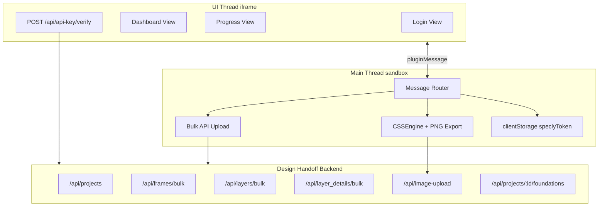
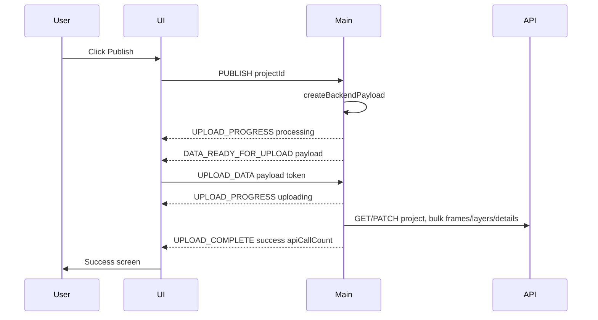

# Design Handoff Figma Plugin — Standalone Rebuild Specification

**Purpose:** This document is the **only** reference for rebuilding the Design Handoff Figma plugin. The implementing agent has **no access to the original codebase**. Every behavior, type, algorithm, API contract, UI string, and constant needed for one-for-one parity is defined here.

**Product:** Design Handoff is a Figma/FigJam plugin that extracts design specs from selected frames and publishes them to the Design Handoff backend API. It also exports Figma variables and local styles as foundational design tokens.

---

## 0. Prerequisites & Constraints

### Figma Plugin API constraints (main thread)

- No DOM, no `window`, no `document`
- No `FormData`, no `TextEncoder` (must build multipart manually; use char-code string conversion)
- No CORS restrictions on `fetch` — all API calls except API key verify run here
- Access to `figma.*` APIs, `figma.clientStorage`, `figma.notify`, `figma.ui.postMessage`
- Must use `/// <reference types="@figma/plugin-typings" />`

### UI thread constraints

- Runs in iframe with DOM
- Communicates via `parent.postMessage({ pluginMessage: {...} }, "*")`
- Receives via `window.onmessage` — payload is `event.data.pluginMessage`
- API key validation runs here (browser fetch, CORS applies)
- Can use React or any UI framework

### Environment variable

```
VITE_API_URL=<base URL, e.g. http://localhost:3000 or https://www.design-handoff.co.uk>
```

Must be injected at **build time** into both main and UI bundles. Example Vite config pattern:

```typescript
define: {
  'import.meta.env.VITE_API_URL': JSON.stringify(env.VITE_API_URL || ''),
}
```

Store in `.env` at project root. All API URLs are `${import.meta.env.VITE_API_URL}/api/...`.

---

## 1. Plugin Manifest (exact JSON)

Create `manifest.json`:

```json
{
  "documentAccess": "dynamic-page",
  "api": "1.0.0",
  "networkAccess": {
    "allowedDomains": [
      "http://localhost:3000",
      "https://www.design-handoff.co.uk",
      "https://design-handoff.co.uk"
    ],
    "reasoning": "The plugin needs to communicate with the Design Handoff PocketBase API to validate API keys and upload design data. Localhost is used only during development. Design Handoff.co.uk is used for production."
  },
  "id": "com.design-handoff.plugin",
  "name": "Design Handoff",
  "main": "src/main/main.ts",
  "ui": "src/ui/ui.tsx",
  "editorType": ["figma", "figjam"]
}
```

No menu commands, no relaunch buttons, no parameters. Single UI plugin only.

---

## 2. Main Thread Entry Point

On plugin load, execute:

```typescript
export default function() {
  figma.showUI(__html__, { width: 400, height: 600, themeColors: true });

  // Selection listener — register immediately
  figma.on("selectionchange", () => {
    const count = figma.currentPage.selection.filter(
      (node) => node.type === "FRAME" || node.type === "COMPONENT" || node.type === "INSTANCE"
    ).length;
    figma.ui.postMessage({ type: "SELECTION_CHANGED", count });
  });

  figma.ui.onmessage = async (msg) => {
    // Route by msg.type — see Section 6
  };
}
```

`__html__` is the bundled UI HTML injected by the build tool.

---

## 3. Architecture Overview




**Critical split:** Only `POST /api/api-key/verify` runs in UI. Everything else runs in main.

---

## 4. Constants

```typescript
// Plan limits — hardcoded in BOTH UI and main (no plan/tier API exists)
const FREE_PLAN_MAX_PROJECTS = 1;
const FREE_PLAN_MAX_FRAMES_PER_PROJECT = 50;

// Storage keys
const STORAGE_KEY_TOKEN = "speclyToken";
const STORAGE_KEY_THEME = "vite-ui-theme"; // handlers exist but UI never uses

// Image export
const MAX_FILE_SIZE = 4.5 * 1024 * 1024; // 4,718,592 bytes
const MAX_DIMENSIONS = [4096, 3072, 2048, 1536, 1024, 768, 512];

// Concurrency
const FRAME_PROCESSING_CONCURRENCY = 3;

// Auth
const MIN_API_KEY_LENGTH = 6; // after trim

// Placeholder thumbnail base
const PLACEHOLDER_THUMBNAIL = "/placeholder.svg?height=200&width=375";
```

---

## 5. Complete TypeScript Type Definitions

Create `src/types.ts` with these exact interfaces:

```typescript
// --- Backend entities ---

export interface Project {
  id: string;
  name: string;
  thumbnail: string;
  figmaFileUrl: string;
  frameCount: number;
  lastUpdated: string;
  createdBy: string;
}

export interface Frame {
  id: string;           // "frame_{sanitized_figma_id}"
  name: string;
  width: number;        // Math.round
  height: number;       // Math.round
  thumbnail: string;    // placeholder SVG URL
  figmaUrl: string;     // deep link with node-id
}

export interface Layer {
  id: string;           // raw Figma node.id (NOT sanitized)
  name: string;
  type: string;         // Figma node.type string e.g. "FRAME", "TEXT"
  x: number;
  y: number;
  width: number;
  height: number;
  clickable: boolean;   // always true
  children?: Layer[];
}

export interface FrameDetail extends Frame {
  imageUrl: string;     // uploaded URL or placeholder
  layers: Layer[];      // hierarchical tree, depth 0 = direct children of frame
}

export interface Layout {
  position: { x: number; y: number };
  dimensions: { width: number; height: number };
  padding?: { top: number; right: number; bottom: number; left: number };
  margin?: { top: number; right: number; bottom: number; left: number };
}

export interface Styles {
  backgroundColor: string;
  borderRadius?: string;
  borderWidth?: string;
  borderColor?: string;
  boxShadow?: string;
  opacity: number;
}

export interface Typography {
  fontFamily: string;
  fontSize: string;       // e.g. "16px"
  fontWeight: number | string;
  lineHeight: string;     // e.g. "24px"
  letterSpacing: string;  // e.g. "0px"
  color: string;
  textAlign: string;      // "left" | "center" | "right"
  textDecoration: string; // "underline" | "none"
  textTransform: string;  // always "none"
}

export interface Code {
  css: string;
  tailwind: string;
  react: string;
}

export interface LayerDetail {
  id: string;
  name: string;
  type: string;
  x: number;
  y: number;
  width: number;
  height: number;
  layout: Layout;
  styles: Styles;
  typography: Typography | null;
  code: Code;
}

export interface Version {
  id: string;
  number: number;
  timestamp: string;
  publishedBy: string;
  changeCount: number;
  notes: string;
  thumbnail: string;
  isCurrent: boolean;
}

export interface BackendPayload {
  project: Project;
  projectFrames: {
    projectId: string;
    frames: Frame[];
  };
  frames: Record<string, FrameDetail>;  // keyed by Frame.id (frame_xxx)
  layers: Record<string, LayerDetail>;  // keyed by Figma node.id
  // version field is built internally but MUST NOT be included in upload
}

export type UploadStatus = 'idle' | 'processing' | 'uploading' | 'complete' | 'error';

export interface UploadProgress {
  current: number;
  total: number;
  currentItemName: string;
  status: UploadStatus;
  apiCallCount?: number;
}

// --- Foundational export ---

export interface FoundationalExport {
  variables: Record<string, VariableCollectionExport>;
  styles: {
    paint: PaintStyleExport[];
    text: TextStyleExport[];
    effect: EffectStyleExport[];
    grid: GridStyleExport[];
  };
}

export interface VariableCollectionExport {
  id: string;
  name: string;
  modes: { modeId: string; name: string }[];
  variables: VariableExport[];
}

export interface VariableExport {
  id: string;
  name: string;
  type: string;  // "BOOLEAN" | "FLOAT" | "STRING" | "COLOR"
  valuesByMode: Record<string, any>;
  description: string;
  scopes: string[];
  codeSyntax: Record<string, string>;
}

export interface BaseStyleExport {
  id: string;
  name: string;
  description: string;
  type: string;
}

export interface PaintStyleExport extends BaseStyleExport {
  paints: any[];  // Figma Paint objects
}

export interface TextStyleExport extends BaseStyleExport {
  fontName: { family: string; style: string };
  fontSize: number;
  fontWeight: number;       // hardcoded 400 placeholder
  lineHeight: any;
  letterSpacing: any;
  textDecoration: string;
  paragraphIndent: number;
  paragraphSpacing: number;
  textCase: string;
}

export interface EffectStyleExport extends BaseStyleExport {
  effects: any[];  // Figma Effect objects
}

export interface GridStyleExport extends BaseStyleExport {
  layoutGrids: any[];  // Figma LayoutGrid objects
}

// --- Internal CSS helper type ---

export interface CSSData {
  display: string;
  flexDirection?: string;
  flexWrap?: string;
  justifyContent?: string;
  alignItems?: string;
  alignContent?: string;
  alignSelf?: string;
  flexGrow?: string | number;
  gap?: string;
  padding?: string;
  width: string;
  height: string;
  backgroundColor?: string;
  borderRadius?: string;
  color?: string;
  fontSize?: string;
  fontFamily?: string;
}
```

---

## 6. Message Protocol — Complete Reference

### 6.1 Communication patterns

**UI → Main:**

```typescript
parent.postMessage({ pluginMessage: { type: "MESSAGE_TYPE", ...fields } }, "*");
```

**Main → UI:**

```typescript
figma.ui.postMessage({ type: "MESSAGE_TYPE", ...fields });
```

**UI receives:**

```typescript
window.onmessage = (event: MessageEvent) => {
  if (!event.data?.pluginMessage) return;
  const msg = event.data.pluginMessage;
  switch (msg.type) { ... }
};
```

### 6.2 UI → Main messages

#### `CHECK_AUTH`

- **Payload:** none
- **Handler:**
  1. `token = await figma.clientStorage.getAsync("speclyToken")`
  2. If token exists: log "Found stored token, returning without validation"
  3. Send `{ type: "AUTH_RESULT", token: token || null }`
  4. Do NOT re-validate on reload

#### `LOGIN`

- **Payload:** `{ token: string }`
- **Precondition:** Token already validated in UI via `/api/api-key/verify`
- **Handler:**
  1. `await figma.clientStorage.setAsync("speclyToken", msg.token)`
  2. Read back: `savedToken = await figma.clientStorage.getAsync("speclyToken")`
  3. If `savedToken === msg.token`: send `{ type: "AUTH_RESULT", token: msg.token }`
  4. Else: throw, notify `"Failed to save API key: ..."`, clear token, send `{ type: "AUTH_RESULT", token: null }`

#### `LOGOUT`

- **Payload:** none
- **Handler:**
  1. `await figma.clientStorage.setAsync("speclyToken", null)`
  2. Send `{ type: "AUTH_RESULT", token: null }`

#### `FETCH_PROJECTS`

- **Payload:** `{ token?: string }`
- **Handler:**
  1. `token = msg.token || await figma.clientStorage.getAsync("speclyToken")`
  2. If no token: throw `"No API key found. Please log in again."`
  3. `GET ${VITE_API_URL}/api/projects` with headers `{ "X-API-Key": token, "Content-Type": "application/json" }`
  4. If status 401 or 403: clear token, send `{ type: "AUTH_RESULT", token: null }`, throw `"API key is invalid. Please log in again."`
  5. Parse response — accept array OR `{ items: [...] }`
  6. Map each item (see Section 13.1)
  7. Send `{ type: "PROJECTS_LOADED", projects }`
  8. On error: send `{ type: "PROJECTS_ERROR", error: message }`, notify `"Failed to load projects: ..."`

#### `PUBLISH`

- **Payload:** `{ projectId: string }`
- **Handler:** See Section 9.1

#### `UPLOAD_DATA`

- **Payload:** `{ payload: BackendPayload, token: string }`
- **Handler:** See Section 13

#### `EXPORT_FOUNDATIONAL`

- **Payload:** `{ projectId: string }`
- **Handler:**
  1. `data = await getFoundationalElements()` (Section 15)
  2. If `msg.projectId`: send `{ type: "FOUNDATIONAL_DATA_READY_FOR_UPLOAD", data, projectId: msg.projectId }`
  3. Else (unused in current UI): send `{ type: "FOUNDATIONAL_EXPORT_READY", data }`, notify `"Foundational elements exported!"`

#### `UPLOAD_FOUNDATIONAL_DATA`

- **Payload:** `{ data: FoundationalExport, projectId: string, token: string }`
- **Handler:**
  1. `token = msg.token || await figma.clientStorage.getAsync("speclyToken")`
  2. If no token: send `{ type: "FOUNDATIONAL_UPLOAD_COMPLETE", success: false, error: "Not authenticated" }`
  3. `POST ${VITE_API_URL}/api/projects/${projectId}/foundations`
  4. Headers: `{ "Content-Type": "application/json", "X-API-KEY": token }` (note: KEY not Key)
  5. Body: `JSON.stringify(data)`
  6. On success: notify `"Variables & Styles uploaded successfully!"`, send `{ type: "FOUNDATIONAL_UPLOAD_COMPLETE", success: true }`
  7. On error: notify error, send `{ type: "FOUNDATIONAL_UPLOAD_COMPLETE", success: false, error }`

#### `NOTIFY`

- **Payload:** `{ message: string }`
- **Handler:** `figma.notify(msg.message)`

#### Legacy handlers (implement but UI never sends)

- `GET_THEME`: read `vite-ui-theme` from storage, send `{ type: "THEME_CHANGED", theme }`
- `THEME_CHANGE`: save theme, send `{ type: "THEME_CHANGED", theme: msg.theme }`
- `API_KEY_VALIDATION_RESULT`: legacy login validation path

### 6.3 Main → UI messages


| type                                 | fields                                     | UI action                                     |
| ------------------------------------ | ------------------------------------------ | --------------------------------------------- |
| `SELECTION_CHANGED`                  | `count: number`                            | `setSelectionCount(count)`                    |
| `AUTH_RESULT`                        | `token: string                             | null`                                         |
| `PROJECTS_LOADED`                    | `projects: Project[]`                      | Set projects; auto-select if length === 1     |
| `PROJECTS_ERROR`                     | `error: string`                            | Stop loading; notify user                     |
| `UPLOAD_PROGRESS`                    | `current, total, currentItemName, status?` | Update progress bar                           |
| `DATA_READY_FOR_UPLOAD`              | `payload: BackendPayload`                  | Call uploadData(payload) → sends UPLOAD_DATA  |
| `UPLOAD_COMPLETE`                    | `success, error?, apiCallCount?`           | Show success/error screen                     |
| `PUBLISH_COMPLETE`                   | `success, error?`                          | Reset publishing on failure                   |
| `FOUNDATIONAL_DATA_READY_FOR_UPLOAD` | `data, projectId`                          | Send UPLOAD_FOUNDATIONAL_DATA                 |
| `FOUNDATIONAL_UPLOAD_COMPLETE`       | `success, error?`                          | Set isExporting false                         |
| `FOUNDATIONAL_EXPORT_READY`          | `data`                                     | Download JSON as `foundational-elements.json` |


---

## 7. UI Implementation — Complete Specification

### 7.1 React state variables

```typescript
const [token, setToken] = useState<string | null>(null);
const [loading, setLoading] = useState(true);
const [selectionCount, setSelectionCount] = useState(0);
const [isPublishing, setIsPublishing] = useState(false);
const [isExporting, setIsExporting] = useState(false);
const [isAuthenticating, setIsAuthenticating] = useState(false);
const [authError, setAuthError] = useState<string | null>(null);
const [projects, setProjects] = useState<Project[]>([]);
const [selectedProjectId, setSelectedProjectId] = useState<string>("");
const [loadingProjects, setLoadingProjects] = useState(false);
const [inputToken, setInputToken] = useState("");
const [uploadProgress, setUploadProgress] = useState<UploadProgress | null>(null);
const [startTime, setStartTime] = useState<number | null>(null);
```

### 7.2 Mount lifecycle

1. Register `window.onmessage` handler (Section 6.3)
2. Send `{ type: "CHECK_AUTH" }`
3. On cleanup: `window.onmessage = null`

### 7.3 View routing (mutually exclusive)

```
if (loading) → Loading View
else if (!token) → Login View
else if (uploadProgress !== null) → Progress/Success/Error View (sub-routed by status)
else → Dashboard View
```

### 7.4 Loading View

- Text: `"Loading..."`
- Container: `p-5 font-sans flex flex-col gap-4 h-full`

### 7.5 Login View — exact copy


| Element           | Content                                                                               |
| ----------------- | ------------------------------------------------------------------------------------- |
| Heading           | `Design Handoff`                                                                              |
| Description       | `Enter your API key to authenticate. You can create an API key in the web dashboard.` |
| Label             | `API Key or Token`                                                                    |
| Input placeholder | `Paste your API key here`                                                             |
| Input type        | `password`                                                                            |
| Button            | `Connect Account` (or `Validating...` when authenticating)                            |
| Error             | `Invalid API key. Please check your key and try again.`                               |
| Footer            | `API keys can be created in your dashboard here:`                                     |
| Link              | `design-handoff.co.uk/api-keys` → `https://www.design-handoff.co.uk/api-keys` target `_blank`         |


**Login handler (`handleLogin`):**

1. `trimmedToken = inputToken.trim()`
2. If `trimmedToken.length > 5`:
  - Set `isAuthenticating = true`, clear `authError`
  - Call `validateApiKey(trimmedToken)` (Section 8)
  - If invalid: set error, send `{ type: "AUTH_RESULT", token: null }` to self, return
  - If valid: send `{ type: "LOGIN", token: trimmedToken }`
3. Else: send `{ type: "NOTIFY", message: "❌ Please enter a valid API key or token" }`

**Button disabled when:** `inputToken.trim().length <= 5 || isAuthenticating`
**Enter key:** triggers `handleLogin`

### 7.6 Dashboard View — exact copy


| Element             | Content                                                                                                                 |
| ------------------- | ----------------------------------------------------------------------------------------------------------------------- |
| Header              | `Design Handoff Project` + badge `Beta`                                                                                         |
| Plan heading        | `Current Plan`                                                                                                          |
| Plan text           | `You are currently on the Free Plan. Limited to 1 project and 50 frames.`                                               |
| Project limit label | `Project limit` → shows `{projects.length}/1`                                                                           |
| Frames limit label  | `Frames limit (selected project)` → shows `{framesUsed}/50`                                                             |
| Over-limit warning  | `Free plan is limited to 1 project. You currently have {N}. Please upgrade or delete extra projects in the dashboard.`  |
| Project label       | `Select Project`                                                                                                        |
| Loading projects    | `Loading projects...`                                                                                                   |
| Dropdown default    | `-- Choose a project --`                                                                                                |
| No projects         | `No projects available. Create one in the dashboard first.`                                                             |
| Frames remaining    | `Frames remaining on this project: {N}`                                                                                 |
| Over frame limit    | `You selected {selectionCount} frame(s), but only {framesRemaining} can be published to this project on the Free plan.` |
| Selection box (0)   | `Select a frame to publish`                                                                                             |
| Selection box (N)   | `{N} frame(s) selected — {framesRemaining} remaining` (only show remaining if project selected)                         |
| Primary button      | `Publish to Dev Handoff` (or `Processing...`)                                                                           |
| Secondary button    | `Publish Variables & Styles` (or `Uploading Foundations...`)                                                            |
| Footer              | `Logged in.` + `Logout` link                                                                                            |


**Computed values:**

```typescript
const selectedProject = projects.find(p => p.id === selectedProjectId);
const framesUsed = selectedProject?.frameCount ?? 0;
const framesRemaining = Math.max(0, FREE_PLAN_MAX_FRAMES_PER_PROJECT - framesUsed);
const projectsOverLimit = projects.length > FREE_PLAN_MAX_PROJECTS;
const framesOverLimit = !!selectedProjectId && selectionCount > framesRemaining;
```

**Button disable rules:**

- Publish: `selectionCount === 0 || !selectedProjectId || isPublishing || projectsOverLimit || framesOverLimit`
- Foundational: `isExporting || !selectedProjectId`
- Project dropdown: `projectsOverLimit`

**handlePublish:**

1. If no project: notify `"❌ Please select a project first"`
2. Set `isPublishing = true`, `startTime = Date.now()`
3. Set progress: `{ current: 0, total: 100, currentItemName: "Processing design...", status: 'processing' }`
4. Send `{ type: "PUBLISH", projectId: selectedProjectId }`

**handleExportFoundational:**

1. If no project: notify `"❌ Please select a project first"`
2. Set `isExporting = true`
3. Send `{ type: "EXPORT_FOUNDATIONAL", projectId: selectedProjectId }`

**handleLogout:** Send LOGOUT, clear all auth/project/progress state locally.

### 7.7 Progress View

**Percent:** `Math.min(100, Math.round((current / total) * 100))`

**ETA (`getEstimatedTime`):**

```typescript
if (!startTime || !uploadProgress || uploadProgress.current === 0) return "Calculating...";
const elapsed = Date.now() - startTime;
const msPerItem = elapsed / uploadProgress.current;
const remainingMs = msPerItem * (uploadProgress.total - uploadProgress.current);
if (remainingMs < 1000) return "Almost done...";
const seconds = Math.ceil(remainingMs / 1000);
return seconds > 60 ? `${Math.ceil(seconds / 60)}m remaining` : `${seconds}s remaining`;
```


| State        | Header                    | Content                                                                             |
| ------------ | ------------------------- | ----------------------------------------------------------------------------------- |
| `processing` | `Processing Design...`    | Progress bar + current task + `"Please do not close the plugin window."`            |
| `uploading`  | `Publishing...`           | Same layout                                                                         |
| `complete`   | `Published Successfully!` | ✅ emoji, `"Your design has been uploaded to Design Handoff."`, summary box, `"Done"` button |
| `error`      | `Upload Failed`           | ❌ emoji, error message, `"Go Back"` button                                          |


**Success summary box:**

```
Summary:
Total items processed: {total}
Total API calls made: {apiCallCount}  // if defined
```

### 7.8 AUTH_RESULT handler details

When token received:

1. Set token, loading false, clear authError, clear inputToken
2. Set loadingProjects true
3. After 100ms timeout: send `{ type: "FETCH_PROJECTS", token }`

When token null after login attempt:

- If `!loading && isAuthenticating`: show auth error
- Clear selectedProjectId and projects

---

## 8. API Key Validation (UI thread only)

```typescript
async function validateApiKey(token: string): Promise<boolean> {
  const response = await fetch(`${VITE_API_URL}/api/api-key/verify`, {
    method: "POST",
    headers: { "Content-Type": "application/json" },
    body: JSON.stringify({ apiKey: token }),
  });

  if (!response.ok) return false;

  const data = await response.json();
  return data.valid === true || data.valid === "true";
}
```

---

## 9. Publish Pipeline — Main Thread

### 9.1 PUBLISH handler

```
1. If !msg.projectId:
     notify "❌ Please select a project first."
     send PUBLISH_COMPLETE { success: false }
     return

2. selection = figma.currentPage.selection
   If selection.length === 0:
     notify "❌ Please select at least one frame."
     send PUBLISH_COMPLETE { success: false }
     return

3. token = await clientStorage.get("speclyToken")
   If !token:
     notify "❌ Please authenticate first."
     send PUBLISH_COMPLETE { success: false }
     return

4. frames = selection.filter(type in [FRAME, COMPONENT, INSTANCE])
   If frames.length === 0:
     notify "❌ Please select at least one frame, component, or instance."
     send PUBLISH_COMPLETE { success: false }
     return

5. await enforceFreePlanLimitsOrThrow({ token, selectedProjectId: msg.projectId, framesToAdd: frames.length })

6. payload = await createBackendPayload(frames, msg.projectId, token, onProgress)
   onProgress sends UPLOAD_PROGRESS { current, total, currentItemName, status: 'processing' }

7. send DATA_READY_FOR_UPLOAD { payload }
   notify "✅ Data serialized! Uploading..."

8. On catch:
   notify "❌ {errorMessage}"
   send PUBLISH_COMPLETE { success: false, error: errorMessage }
```

### 9.2 enforceFreePlanLimitsOrThrow

```
1. projects = await fetchProjectsFromApi(token)
2. If projects.length > FREE_PLAN_MAX_PROJECTS:
     throw "Free plan limit exceeded: 1 project. You currently have {N}. Please upgrade or delete extra projects in the dashboard."

3. selectedProject = projects.find(p => p.id === selectedProjectId)
   If !selectedProject:
     throw "Selected project not found. Please refresh projects and try again."

4. existingFrameCount = selectedProject.frameCount || 0
   nextFrameCount = existingFrameCount + framesToAdd

5. If nextFrameCount > 50:
     overBy = nextFrameCount - 50
     throw "Free plan limit exceeded: 50 frames per project. This project already has {existing}. You selected {framesToAdd}. Remove {overBy} frame(s) or upgrade your plan."

6. return { selectedProject, existingFrameCount, nextFrameCount }
```

### 9.3 fetchProjectsFromApi

```
GET ${VITE_API_URL}/api/projects
Headers: { X-API-Key: token, Content-Type: application/json }

Parse: array OR response.items
Map each item:
  id: item.id
  name: item.name
  thumbnail: item.thumbnail || "/placeholder.svg?height=200&width=375"
  figmaFileUrl: item.figma_file_url || ""
  frameCount: item.frame_count || 0
  lastUpdated: item.updated || item.created
  createdBy: "User"
```

### 9.4 createBackendPayload — full algorithm

**Inputs:** `frames: SceneNode[]`, `selectedProjectId: string`, `token: string`, `onProgress?: (current, total, message) => void`

**Outputs:** `BackendPayload`

```
1. VALIDATE: if frames.length === 0, throw "No frames selected"

2. BUILD FILE URL:
   fileKey = figma.fileKey
   if fileKey:
     fileUrl = "https://figma.com/file/{fileKey}"
   else:
     log warning "File not saved to Figma servers..."
     fileUrl = "https://figma.com/file/unknown"

3. BUILD PROJECT OBJECT:
   project = {
     id: selectedProjectId,
     name: figma.root.name || "Untitled Project",
     thumbnail: "/placeholder.svg?height=200&width=375",
     figmaFileUrl: fileUrl,
     frameCount: frames.length,
     lastUpdated: new Date().toISOString(),
     createdBy: "Figma User"
   }

4. INITIALIZE:
   projectFrames = []
   framesDetail = {}
   layersDetail = {}
   frameProcessingResults = []
   validFrames = frames.filter(type in [FRAME, COMPONENT, INSTANCE])
   totalSteps = 1 + validFrames.length + validFrames.length
   currentStep = 0

5. PRE-LOAD FONTS:
   onProgress(0, totalSteps, "Pre-loading fonts...")
   await batchLoadFonts(frames)  // Section 10.1
   currentStep++

6. PROCESS FRAMES (concurrency 3):
   await processFramesInParallel(validFrames, async (frame, index) => {
     onProgress(currentStep + index + 1, totalSteps, "Processing {frame.name} ({index+1}/{total})...")

     frameId = "frame_" + frame.id.replace(/[:;]/g, '_')
     frameUrl = fileUrl + "?node-id=" + frame.id.replace(/[:;]/g, '-')
     thumbnail = "/placeholder.svg?height={round(frame.height)}&width={round(frame.width)}"
     fileName = frame.name.replace(/[^a-z0-9]/gi, '_') + "_" + frame.id.replace(/[:;]/g, '_') + ".png"

     // PNG EXPORT — Section 10.2
     imageBytes = await exportFramePng(frame)

     frameEntry = { id: frameId, name: frame.name, width: round(frame.width), height: round(frame.height), thumbnail, figmaUrl: frameUrl }

     // LAYER EXTRACTION — Section 10.3
     layers = []
     if frame has children:
       visibleChildren = frame.children.filter(child => isNodeVisibleInFrame(child, frame))
       layers = await Promise.all(visibleChildren.map(child => nodeToLayer(child, frame)))
       layers = layers.filter(non-null)
       await Promise.all(visibleChildren.map(child => processLayerDetailsRecursively(child, frame)))

     frameDetail = { ...frameEntry, imageUrl: "__PENDING_UPLOAD__" + frameId, layers }

     frameProcessingResults.push({ frameEntry, frameDetail, imageBytes, fileName })
   }, 3)

   currentStep += validFrames.length

7. UPLOAD ALL PNGs IN PARALLEL:
   onProgress(currentStep, totalSteps, "Uploading images in parallel...")
   await Promise.all(frameProcessingResults.map(async (result, index) => {
     onProgress(currentStep + index + 1, totalSteps, "Uploading {result.frameEntry.name} ({index+1}/{total})...")
     uploadResult = await uploadImage(result.imageBytes, result.fileName, token)
     if uploadResult.url: result.frameDetail.imageUrl = uploadResult.url
     else if uploadResult.isSizeError: throw "Server rejected image upload for frame \"{name}\" due to file size."
     else: throw "Failed to upload image for frame \"{name}\""
   }))

8. COMBINE RESULTS:
   for each result in frameProcessingResults:
     projectFrames.push(result.frameEntry)
     framesDetail[result.frameEntry.id] = result.frameDetail

9. RETURN:
   {
     project,
     projectFrames: { projectId: selectedProjectId, frames: projectFrames },
     frames: framesDetail,
     layers: layersDetail
   }
   // Do NOT include version object
```

### 9.5 isNodeVisibleInFrame

```
bounds = getNodeBounds(node, frameNode)
nodeRight = bounds.x + bounds.width
nodeBottom = bounds.y + bounds.height
return NOT (
  nodeRight < 0 OR
  bounds.x > frameNode.width OR
  nodeBottom < 0 OR
  bounds.y > frameNode.height
)
```

### 9.6 processLayerDetailsRecursively

```
async function processLayerDetailsRecursively(node, parentFrame):
  if !isNodeVisibleInFrame(node, parentFrame): return

  layerDetail = await nodeToLayerDetail(node, parentFrame)
  if layerDetail: layersDetail[layerDetail.id] = layerDetail

  if node has children:
    await Promise.all(node.children.map(child => processLayerDetailsRecursively(child, parentFrame)))
```

---

## 10. Concurrency & Export Helpers

### 10.1 batchLoadFonts

```
1. fontSet = new Set<string>()
2. Recursively walk all nodes in input frames:
   if node.type === "TEXT" && node.fontName is object:
     fontSet.add("{family}-{style}")

3. For each fontKey in fontSet (parallel):
   Find a TextNode with matching fontName
   try: await figma.loadFontAsync(fontName)
   catch: console.warn, continue

4. Log "Loaded {fontSet.size} unique fonts in parallel"
```

### 10.2 processFramesInParallel

```
async function processFramesInParallel(items, processor, concurrency=3, onProgress?):
  completed = 0
  for i = 0; i < items.length; i += concurrency:
    batch = items.slice(i, i + concurrency)
    await Promise.all(batch.map((item, batchIndex) =>
      processor(item, i + batchIndex).then(() => {
        completed++
        onProgress?.(completed, items.length, "Processed {completed}/{items.length} items...")
      })
    ))
```

### 10.3 exportFramePng — full algorithm

```
MAX_FILE_SIZE = 4.5 * 1024 * 1024
MAX_DIMENSIONS = [4096, 3072, 2048, 1536, 1024, 768, 512]

estimatedPixelCount = frame.width * frame.height
startIndex = 0
if estimatedPixelCount > 8_000_000: startIndex = 2
else if estimatedPixelCount > 4_000_000: startIndex = 1

for attempt = startIndex to MAX_DIMENSIONS.length - 1:
  MAX_DIMENSION = MAX_DIMENSIONS[attempt]

  // Determine constraint
  if frame.width > MAX_DIMENSION OR frame.height > MAX_DIMENSION:
    if frame.width > frame.height:
      constraint = { type: 'WIDTH', value: MAX_DIMENSION }
    else:
      constraint = { type: 'HEIGHT', value: MAX_DIMENSION }
  else:
    if attempt === startIndex:
      constraint = { type: 'SCALE', value: 2 }  // retina
    else:
      if frame.width > frame.height:
        constraint = { type: 'WIDTH', value: MAX_DIMENSION }
      else:
        constraint = { type: 'HEIGHT', value: MAX_DIMENSION }

  try:
    exportedBytes = await frame.exportAsync({ format: 'PNG', constraint })

    if exportedBytes.length > MAX_FILE_SIZE:
      if attempt < last index: continue  // try smaller
      else: throw "Image file size ({MB} MB) is too large even at minimum resolution. Maximum allowed: 4.5 MB."

    return exportedBytes  // success

  catch exportError:
    if error message includes "too large" AND attempt < last: continue
    else: throw exportError

throw "Failed to export image for frame \"{name}\" within size limit after multiple attempts."
```

### 10.4 uploadImage — manual multipart

**Why manual:** Figma sandbox has no `FormData`.

```
async function uploadImage(imageBytes: Uint8Array, fileName: string, token: string):
  endpoint = VITE_API_URL + "/api/image-upload"
  notify "🔄 Uploading to: {endpoint}"

  boundary = "----WebKitFormBoundary" + random alphanumeric (13 chars)

  contentType = fileName.endsWith('.jpg') or '.jpeg' ? 'image/jpeg' : 'image/png'

  // Build multipart body manually:
  header = "--{boundary}\r\nContent-Disposition: form-data; name=\"image\"; filename=\"{fileName}\"\r\nContent-Type: {contentType}\r\n\r\n"
  footer = "\r\n--{boundary}--\r\n"

  body = concat( stringToUint8Array(header), imageBytes, stringToUint8Array(footer) )

  response = await fetch(endpoint, {
    method: 'POST',
    headers: {
      'X-API-Key': token,
      'Content-Type': 'multipart/form-data; boundary={boundary}'
    },
    body: body
  })

  if !response.ok:
    parse error text
    isSizeError = status === 413 OR message contains (case-insensitive):
      "too large", "file size", "max size", "size limit", "exceeds"
    if isSizeError: return { isSizeError: true }
    throw error

  result = await response.json()
  url = result.url || result.imageUrl || result.image_url
  return { url }
```

**stringToUint8Array** (no TextEncoder available):

```typescript
function stringToUint8Array(str: string): Uint8Array {
  const arr = new Uint8Array(str.length);
  for (let i = 0; i < str.length; i++) arr[i] = str.charCodeAt(i);
  return arr;
}
```

---

## 11. CSSEngine — Complete Algorithm Reference

Implement as `src/main/CSSEngine.ts`. All functions below are required.

### 11.1 toPx

```typescript
const toPx = (val: number) => `${Math.round(val)}px`;
```

### 11.2 getNodeBounds(node, frameNode?)

**Purpose:** Rotation-aware bounds. When `frameNode` provided, returns coordinates relative to frame origin.

```
function computeBoundsFromTransform(transform, w, h):
  isIdentity = abs(transform[0][0]-1) < 0.001 AND abs(transform[0][1]) < 0.001
               AND abs(transform[1][0]) < 0.001 AND abs(transform[1][1]-1) < 0.001

  if isIdentity:
    return { x: transform[0][2] ?? 0, y: transform[1][2] ?? 0, width: w, height: h }

  corners = [[0,0], [w,0], [w,h], [0,h]]
  transformedCorners = corners.map([cx,cy] =>
    tx = transform[0][0]*cx + transform[0][1]*cy + transform[0][2]
    ty = transform[1][0]*cx + transform[1][1]*cy + transform[1][2]
    return [tx, ty]
  )
  minX = min(x values), minY = min(y values)
  maxX = max(x values), maxY = max(y values)
  return { x: minX, y: minY, width: maxX-minX, height: maxY-minY }

nodeAbs = computeBoundsFromTransform(node.absoluteTransform, node.width, node.height)

if frameNode:
  frameAbs = computeBoundsFromTransform(frameNode.absoluteTransform, frameNode.width, frameNode.height)
  return {
    x: nodeAbs.x - frameAbs.x,
    y: nodeAbs.y - frameAbs.y,
    width: nodeAbs.width,
    height: nodeAbs.height
  }

return nodeAbs
```

### 11.3 rgbToHex(r, g, b)

Figma RGB is 0-1 range:

```
toHex(n) = round(n * 255).toString(16), pad to 2 chars
return "#" + toHex(r) + toHex(g) + toHex(b)
```

### 11.4 getFillColor(fills)

```
if !Array.isArray(fills): return undefined
solid = fills.find(f => f.type === 'SOLID' && f.visible !== false)
if solid: return rgbToHex(solid.color.r, solid.color.g, solid.color.b)
return undefined
```

### 11.5 getOpacity(node)

```
if !("fills" in node) || !Array.isArray(node.fills): return 1
solid = node.fills.find(f => f.type === 'SOLID' && f.visible !== false)
return solid?.opacity !== undefined ? solid.opacity : 1
```

### 11.6 getBoxShadow(effects)

```
if !Array.isArray(effects): return undefined
dropShadow = effects.find(e => e.type === 'DROP_SHADOW' && e.visible !== false)
if dropShadow:
  rgba = "rgba({round(r*255)}, {round(g*255)}, {round(b*255)}, {a||1})"
  return "{offset.x}px {offset.y}px {radius}px {rgba}"
return undefined
```

### 11.7 getBorderInfo(node)

```
if !("strokes" in node) || !Array.isArray(node.strokes) || length === 0: return null
stroke = node.strokes[0]
if stroke.type === 'SOLID':
  color = rgbToHex(stroke.color.r, g, b)
  width = typeof node.strokeWeight === 'number' ? "{strokeWeight}px" : "1px"
  return { width, color }
return null
```

### 11.8 getLayoutProps(node) — Auto Layout → CSS

Only for FRAME/COMPONENT/INSTANCE with `layoutMode !== "NONE"`:

```
if node.layoutMode === "NONE": return { display: "block" }

css = {
  display: "flex",
  gap: toPx(node.itemSpacing),
  flexDirection: node.layoutMode === "HORIZONTAL" ? "row" : "column",
  flexWrap: node.layoutWrap === "WRAP" ? "wrap" : "nowrap"
}

// primaryAxisAlignItems → justifyContent
MIN → flex-start, MAX → flex-end, CENTER → center, SPACE_BETWEEN → space-between

// counterAxisAlignItems → alignItems
MIN → flex-start, MAX → flex-end, CENTER → center, BASELINE → baseline, default → stretch

// if layoutWrap === "WRAP": counterAxisAlignContent → alignContent
MIN → flex-start, MAX → flex-end, CENTER → center, SPACE_BETWEEN → space-between

// padding
if all padding equal and > 0: css.padding = toPx(paddingLeft)
else: css.padding = "{top} {right} {bottom} {left}" using toPx

return css
```

**Child flex props** (when parent is Auto Layout):

```
if node.layoutGrow === 1: extraCss.flexGrow = 1
switch node.layoutAlign:
  MIN → alignSelf: flex-start
  MAX → alignSelf: flex-end
  CENTER → alignSelf: center
  STRETCH → alignSelf: stretch
```

### 11.9 extractTypography(node) — async

Only for TEXT nodes:

```
1. await figma.loadFontAsync(node.fontName) — warn on failure

2. fontSize = typeof node.fontSize === 'number' ? "{fontSize}px" : "16px"
   fontFamily = node.fontName.family or "Inter"
   fontWeight = typeof node.fontWeight === 'number' ? node.fontWeight : 400

3. lineHeight:
   if object with unit PIXELS: "{value}px"
   if PERCENT: round(fontSize * value / 100) + "px"
   else: round(fontSize * 1.5) + "px"

4. letterSpacing:
   if PIXELS: "{value}px"
   if PERCENT: round(fontSize * value / 100) + "px"
   else: "0px"

5. color = getFillColor(node.fills) || "#374151"

6. textAlign: CENTER→center, RIGHT→right, else left
   textDecoration: UNDERLINE→underline, else none
   textTransform: "none"

return Typography object
```

### 11.10 nodeToLayer(node, frameNode?)

```
if !node.visible: return null

bounds = getNodeBounds(node, frameNode)

if frameNode: apply visibility culling (Section 9.5)

layer = {
  id: node.id,
  name: node.name,
  type: node.type,
  x: round(bounds.x), y: round(bounds.y),
  width: round(bounds.width), height: round(bounds.height),
  clickable: true
}

if node has children:
  children = node.children.map(child => nodeToLayer(child, frameNode)).filter(non-null)
  if children.length > 0: layer.children = children

return layer
```

### 11.11 nodeToLayerDetail(node, frameNode?) — async

```
if !node.visible: return null
bounds = getNodeBounds(node, frameNode)
if frameNode: apply visibility culling

x, y, width, height = round(bounds values)

layout = {
  position: { x, y },
  dimensions: { width, height }
}

// Padding (FRAME/COMPONENT/INSTANCE only)
if type in [FRAME, COMPONENT, INSTANCE] AND any padding > 0:
  layout.padding = { top, right, bottom, left } (all rounded)

// Styles
fills = node.fills if exists
backgroundColor = getFillColor(fills) || (TEXT ? "transparent" : "#F3F4F6")
borderRadius = cornerRadius is number ? "{round(cornerRadius)}px" : undefined
border = getBorderInfo(node)
boxShadow = getBoxShadow(node.effects) if exists
opacity = getOpacity(node)

styles = {
  backgroundColor,
  borderRadius,
  borderWidth: border?.width || "0px",
  borderColor: border?.color || "transparent",
  boxShadow,
  opacity
}

typography = node.type === "TEXT" ? await extractTypography(node) : null

// Auto layout CSS extras
extraCss = {}
if type in [FRAME, COMPONENT, INSTANCE]:
  extraCss = { ...extraCss, ...getLayoutProps(node) }

if parent is Auto Layout container:
  apply child flexGrow/alignSelf to extraCss

className = node.name.toLowerCase().replace(/\s+/g, "-")

code = {
  css: generateCSS(className, x, y, width, height, styles, layout, typography, extraCss),
  tailwind: generateTailwind(x, y, width, height, styles, layout, typography),
  react: generateReact(x, y, width, height, styles, layout, typography, extraCss)
}

return { id: node.id, name, type: node.type, x, y, width, height, layout, styles, typography, code }
```

### 11.12 generateCSS

Build string `.className { ... }`:

- If `!extraCss.display || extraCss.display === 'absolute'`: `position: absolute; left: {x}px; top: {y}px;`
- Else: `position: relative;`
- Always: `width: {width}px; height: {height}px;`
- If backgroundColor !== "transparent": `background-color: {color};`
- If borderRadius: include
- If borderWidth !== "0px": include width + color
- If boxShadow: include
- If layout.padding: `padding: {top}px {right}px {bottom}px {left}px;`
- If typography: font-family, font-size, font-weight, line-height, letter-spacing, color, text-align
- If extraCss flex props: display, flexDirection, flexWrap, justifyContent, alignItems, alignContent, alignSelf, flexGrow, gap

### 11.13 generateTailwind

Always starts with: `absolute left-[{x}px] top-[{y}px] w-[{width}px] h-[{height}px]`

Background shortcuts:

- `#FFFFFF`, `#fff`, `white` → `bg-white`
- `#3B82F6`, `#007AFF` → `bg-blue-500`
- `#10B981` → `bg-emerald-500`
- else → `bg-[{color}]`

Border radius shortcuts:

- `8px` → `rounded-lg`, `12px` → `rounded-xl`, `16px` → `rounded-2xl`, else `rounded-[{radius}]`

Box shadow → `shadow-md`

Padding: if all equal → `p-{round(top/4)}`, else `px-{round(left/4)} py-{round(top/4)}`

Typography: `font-sans text-[{size}] font-bold/semibold leading-[...] tracking-[...] text-[{color}]`

### 11.14 generateReact

Same properties as CSS but as JS object string:

- `position: 'absolute'`, `left: {x}`, `top: {y}` (numbers not px strings for x/y/width/height)
- `backgroundColor: '{color}'` (quoted string)
- `borderRadius: {parseFloat(borderRadius)}` (number)
- `padding: '{top}px {right}px {bottom}px {left}px'`
- Flex props as quoted strings

---

## 12. Layer Upload Ordering

### 12.1 flattenLayersByLevel

```
type LayerWithParent = { layer: Layer, parentLayerId?: string, depth: number }

function flattenLayersByLevel(layers, depth=0, parentLayerId?):
  result = []
  for layer in layers:
    result.push({ layer, parentLayerId, depth })
    if layer.children:
      result.push(...flattenLayersByLevel(layer.children, depth+1, layer.id))
  return result
```

### 12.2 Group and upload by depth

```
allLayersByLevel = Map<depth, Array<{ originalId, data, parentLayerId }>>

for each [frameKey, frameDetail] in payload.frames:
  backendFrameId = frameIdMap[frameKey]
  if !backendFrameId: continue

  flattened = flattenLayersByLevel(frameDetail.layers)
  for item in flattened:
    layerData = {
      frame_id: backendFrameId,
      name: item.layer.name,
      type: item.layer.type,
      x: item.layer.x, y: item.layer.y,
      width: item.layer.width, height: item.layer.height,
      clickable: item.layer.clickable
    }
    allLayersByLevel[item.depth].push({ originalId: item.layer.id, data: layerData, parentLayerId: item.parentLayerId })

sortedLevels = sort(allLayersByLevel.keys()) ascending

for level in sortedLevels:
  for item in allLayersByLevel[level]:
    if item.parentLayerId AND layerIdMap[item.parentLayerId]:
      item.data.parent_id = layerIdMap[item.parentLayerId]

  POST /api/layers/bulk with { layers: items.map(i => i.data) }
  Map response IDs: layerIdMap[originalId] = createdLayer.id
```

---

## 13. UPLOAD_DATA — Complete API Sequence

### 13.1 Step-by-step

```
INPUT: msg.payload (BackendPayload), msg.token

1. AUTH CHECK
   token = msg.token || storage
   if !token: UPLOAD_COMPLETE { success: false, error: "Not authenticated" }

2. RE-ENFORCE PLAN LIMITS
   { nextFrameCount } = enforceFreePlanLimitsOrThrow({
     token, selectedProjectId: data.project.id, framesToAdd: data.projectFrames.frames.length
   })

3. INIT PROGRESS
   totalItems = 1 + frameCount + layerCount
   currentItem = 0
   apiCallCount = 0
   logApiCall = (endpoint, method) => { apiCallCount++; log }

4. UPDATE PROJECT
   progress: "Project: {data.project.name}"
   GET /api/projects/{projectId} — must return ok
     if !ok: throw "Selected project no longer exists. Please refresh projects or create one in the dashboard."
   PATCH /api/projects/{projectId}
     body: { figma_file_url: data.project.figmaFileUrl, frame_count: nextFrameCount }

5. BULK CREATE FRAMES
   framesToCreate = []
   for frame in data.projectFrames.frames:
     progress: "Frame: {frame.name}"
     frameDetail = data.frames[frame.id]
     screenshotUrl = frameDetail?.imageUrl || ''

     frameData = {
       project_id: projectId,
       name: frame.name,
       width: frame.width,
       height: frame.height,
       figma_url: frame.figmaUrl,
       sort_order: index in array
     }
     if screenshotUrl.startsWith('data:'): frameData.thumbnail = screenshotUrl
     else if screenshotUrl: frameData.image_url = screenshotUrl

     framesToCreate.push({ originalId: frame.id, data: frameData })

   POST /api/frames/bulk { frames: framesToCreate.map(i => i.data) }
   frameIdMap[originalId] = createdFrame.id for each

6. BULK CREATE LAYERS BY LEVEL (Section 12)

7. BULK CREATE LAYER DETAILS
   layerDetailsToCreate = []
   for each frame in data.frames:
     collect all layer IDs recursively from frameDetail.layers tree
     for each layerId:
       backendLayerId = layerIdMap[layerId]
       layerDetail = data.layers[layerId]
       if both exist:
         layerDetailsToCreate.push({
           layer_id: backendLayerId,
           layout: layerDetail.layout,
           styles: layerDetail.styles,
           typography: layerDetail.typography,
           code: layerDetail.code
         })

   POST /api/layer_details/bulk { layer_details: layerDetailsToCreate }

8. COMPLETE
   totalApiCalls = apiCallCount + frameCount  // image uploads counted separately
   notify "🚀 Published successfully! ({totalApiCalls} API calls)"
   UPLOAD_COMPLETE { success: true, apiCallCount: totalApiCalls }
```

### 13.2 createBulkRecords helper

```
POST body format: { [collectionName]: items }
  frames → { frames: [...] }
  layers → { layers: [...] }
  layer_details → { layer_details: [...] }

Headers: { X-API-Key: token, Content-Type: application/json }

Response: result[collectionName] || []
Error: throw result.error || result.message || HTTP status message
```

### 13.3 Example frame bulk request

```json
{
  "frames": [{
    "project_id": "abc123",
    "name": "Home Screen",
    "width": 375,
    "height": 812,
    "figma_url": "https://figma.com/file/xyz?node-id=1-2",
    "sort_order": 0,
    "image_url": "https://design-handoff.co.uk/uploads/frame-screenshot.png"
  }]
}
```

### 13.4 Example layer bulk request

```json
{
  "layers": [{
    "frame_id": "backend_frame_id",
    "name": "Header",
    "type": "FRAME",
    "x": 0, "y": 0,
    "width": 375, "height": 64,
    "clickable": true,
    "parent_id": "backend_parent_layer_id"
  }]
}
```

### 13.5 Example layer_details bulk request

```json
{
  "layer_details": [{
    "layer_id": "backend_layer_id",
    "layout": {
      "position": { "x": 0, "y": 0 },
      "dimensions": { "width": 375, "height": 64 },
      "padding": { "top": 8, "right": 16, "bottom": 8, "left": 16 }
    },
    "styles": {
      "backgroundColor": "#FFFFFF",
      "borderRadius": "8px",
      "borderWidth": "0px",
      "borderColor": "transparent",
      "opacity": 1
    },
    "typography": null,
    "code": {
      "css": ".header { position: absolute; ... }",
      "tailwind": "absolute left-[0px] top-[0px] ...",
      "react": "{ position: 'absolute', left: 0, ... }"
    }
  }]
}
```

---

## 14. Foundational Export — Complete Algorithm

### 14.1 getFoundationalElements()

```
exportData = { variables: {}, styles: { paint: [], text: [], effect: [], grid: [] } }

// --- VARIABLES ---
collections = await figma.variables.getLocalVariableCollectionsAsync()
for collection in collections:
  collectionExport = {
    id: collection.id,
    name: collection.name,
    modes: collection.modes,
    variables: []
  }

  variables = await Promise.all(collection.variableIds.map(id => getVariableByIdAsync(id)))
  for variable in variables (non-null):
    valuesByMode = {}
    for mode in collection.modes:
      value = variable.valuesByMode[mode.modeId]
      if value is VARIABLE_ALIAS:
        aliasedVar = await getVariableByIdAsync(value.id)
        valuesByMode[mode.modeId] = {
          type: 'VARIABLE_ALIAS',
          id: value.id,
          name: aliasedVar?.name || 'Unknown Variable'
        }
      else:
        valuesByMode[mode.modeId] = processVariableValue(value, variable.resolvedType)

    collectionExport.variables.push({
      id, name, type: resolvedType, valuesByMode,
      description, scopes, codeSyntax
    })

  exportData.variables[collection.name] = collectionExport

// --- STYLES ---
paintStyles = await figma.getLocalPaintStylesAsync()
exportData.styles.paint = paintStyles.map(s => ({ id, name, description, type, paints: s.paints }))

textStyles = await figma.getLocalTextStylesAsync()
exportData.styles.text = textStyles.map(s => ({
  id, name, description, type,
  fontName: s.fontName, fontSize: s.fontSize, fontWeight: 400,
  lineHeight: s.lineHeight, letterSpacing: s.letterSpacing,
  textDecoration: s.textDecoration, paragraphIndent: s.paragraphIndent,
  paragraphSpacing: s.paragraphSpacing, textCase: s.textCase
}))

effectStyles = await figma.getLocalEffectStylesAsync()
exportData.styles.effect = effectStyles.map(s => ({ id, name, description, type, effects: s.effects }))

gridStyles = await figma.getLocalGridStylesAsync()
exportData.styles.grid = gridStyles.map(s => ({ id, name, description, type, layoutGrids: s.layoutGrids }))

return exportData
```

### 14.2 processVariableValue

```
if type === 'COLOR' && value has r,g,b:
  return {
    ...value,
    hex: rgbToHex(r, g, b),
    css: "rgba({round(r*255)}, {round(g*255)}, {round(b*255)}, {a})"
  }
return value
```

### 14.3 Foundational JSON schema (variable value examples)

**Color value:**

```json
{ "r": 0.5, "g": 0.5, "b": 0.5, "a": 1, "hex": "#808080", "css": "rgba(128, 128, 128, 1)" }
```

**Alias value:**

```json
{ "type": "VARIABLE_ALIAS", "id": "VariableID:123", "name": "brand/primary" }
```

**Root structure:**

```json
{
  "variables": {
    "Color Primitives": {
      "id": "...",
      "name": "Color Primitives",
      "modes": [{ "modeId": "...", "name": "Light" }],
      "variables": [{ "id": "...", "name": "brand/primary", "type": "COLOR", "valuesByMode": {}, "description": "", "scopes": ["ALL_FILLS"], "codeSyntax": {} }]
    }
  },
  "styles": {
    "paint": [{ "id": "...", "name": "Primary", "description": "", "type": "PAINT", "paints": [] }],
    "text": [{ "id": "...", "name": "H1", "description": "", "type": "TEXT", "fontName": { "family": "Inter", "style": "Regular" }, "fontSize": 32, "fontWeight": 400, "lineHeight": {}, "letterSpacing": {}, "textDecoration": "NONE", "paragraphIndent": 0, "paragraphSpacing": 0, "textCase": "ORIGINAL" }],
    "effect": [{ "id": "...", "name": "Shadow", "description": "", "type": "EFFECT", "effects": [] }],
    "grid": [{ "id": "...", "name": "12 Column", "description": "", "type": "GRID", "layoutGrids": [] }]
  }
}
```

---

## 15. UI Data Flow After Publish




**UI uploadData function:**

```
if !token: NOTIFY "Not authenticated", return
setStartTime(Date.now())
setUploadProgress({ current: 0, total: 1 + frames + layers, currentItemName: "Preparing upload...", status: 'uploading' })
send UPLOAD_DATA { payload, token }
```

---

## 16. Exact Error & Notify Messages


| Trigger                     | Message                                                               |
| --------------------------- | --------------------------------------------------------------------- |
| No project on publish       | `❌ Please select a project first`                                     |
| No selection                | `❌ Please select at least one frame.`                                 |
| No auth                     | `❌ Please authenticate first.`                                        |
| No valid frame types        | `❌ Please select at least one frame, component, or instance.`         |
| Short API key               | `❌ Please enter a valid API key or token`                             |
| Not authenticated (upload)  | `❌ Not authenticated`                                                 |
| Serialize success           | `✅ Data serialized! Uploading...`                                     |
| Publish success             | `🚀 Published successfully! ({N} API calls)`                          |
| Save token failure          | `❌ Failed to save API key: {message}`                                 |
| Load projects failure       | `❌ Failed to load projects: {message}`                                |
| Projects error (UI)         | `❌ Failed to load projects. Please check your API key and try again.` |
| Foundations success         | `✅ Variables & Styles uploaded successfully!`                         |
| Foundations export (unused) | `✅ Foundational elements exported!`                                   |
| Image upload in progress    | `🔄 Uploading to: {endpoint}`                                         |


---

## 17. Recommended File Structure

```
project-root/
├── manifest.json
├── .env                          # VITE_API_URL=...
├── package.json
├── vite.config.ts                # or equivalent build config
├── src/
│   ├── types.ts                  # Section 5 — shared types
│   ├── main/
│   │   ├── main.ts               # Entry + message router (Section 6)
│   │   ├── CSSEngine.ts          # Section 11
│   │   ├── FoundationalExport.ts # Section 14
│   │   ├── publish.ts            # createBackendPayload (Section 9)
│   │   ├── upload.ts             # UPLOAD_DATA (Section 13)
│   │   ├── imageUpload.ts        # uploadImage (Section 10.4)
│   │   ├── planLimits.ts         # enforceFreePlanLimitsOrThrow (Section 9.2)
│   │   └── concurrency.ts        # batchLoadFonts, processFramesInParallel
│   └── ui/
│       ├── ui.tsx                # React mount into #app
│       ├── App.tsx               # All views (Section 7)
│       └── styles.css            # Tailwind + theme (optional, see Section 18)
└── dist/                         # Build output → import manifest.json in Figma
```

---

## 18. UI Styling (optional parity)

The original uses Tailwind CSS v4 with a mint/sage green theme. Figma's `themeColors: true` syncs with Figma light/dark.

Key CSS variables (light / `.figma-light`):

- `--background: hsl(150 35% 95%)`
- `--foreground: hsl(160 30% 15%)`
- `--primary: hsl(160 45% 20%)`
- `--destructive: hsl(0 84% 60%)`
- `--radius: 0.75rem`

Dark / `.figma-dark`:

- `--background: hsl(160 50% 12%)`
- `--primary: hsl(80 70% 65%)`

Functional parity does not require matching colors — but copy, layout structure, and disable rules must match.

---

## 19. Build & Dev Workflow

1. `npm install`
2. Create `.env` with `VITE_API_URL=http://localhost:3000` (or production URL)
3. `npm run dev` — watch build to `dist/`
4. In Figma Desktop: Plugins → Development → Import plugin from manifest → select `dist/manifest.json`
5. Production: `npm run build`

**Dependencies (reference — any equivalent build tool works):**

- Figma plugin typings
- TypeScript ~5.6
- Build tool that produces `main.js` + `ui.html` from dual entry points
- React 18 (UI only)

---

## 20. What NOT to Implement (intentionally excluded)

These exist in conceptual legacy form but are **not part of live behavior**:


| Item                                                       | Reason                                        |
| ---------------------------------------------------------- | --------------------------------------------- |
| `version` object in BackendPayload upload                  | Built but commented out — do not send         |
| Theme persistence UI (`GET_THEME`/`THEME_CHANGE`)          | Handlers exist, UI never calls                |
| `FOUNDATIONAL_EXPORT_READY` download path                  | UI always passes projectId → upload           |
| `serializeNode()`, `getVariableNames()`, `getStyleNames()` | Not wired into publish flow                   |
| `INSERT_CODE` event type                                   | Unused                                        |
| Auto-discovery of frames on page                           | Never implemented — manual selection only     |
| Per-layer image/asset export                               | Only frame-level PNG screenshots              |
| Project auto-create on upload                              | Explicitly rejected — must exist in dashboard |
| API retry/backoff                                          | Fail fast                                     |
| `userId = "default_user_id"`                               | Hardcoded TODO — not functional               |


---

## 21. Rebuild Verification Checklist

- [ ] Plugin opens 400×600 with themeColors
- [ ] CHECK_AUTH restores token without re-validation
- [ ] API key validated in UI before LOGIN
- [ ] Token persisted in speclyToken clientStorage
- [ ] Projects fetched on auth; auto-select if exactly 1
- [ ] 401/403 on projects clears token
- [ ] Selection count tracks FRAME/COMPONENT/INSTANCE only
- [ ] Publish requires project + selection
- [ ] Free plan limits enforced in UI and main (1 project, 50 frames)
- [ ] createBackendPayload: fonts → frames (concurrency 3) → parallel image upload
- [ ] Recursive layer tree from direct children; visibility culling
- [ ] getNodeBounds handles rotation via absoluteTransform
- [ ] Auto Layout mapped to flex CSS in code output
- [ ] PNG export with 4.5MB limit and dimension fallback ladder
- [ ] Manual multipart image upload (no FormData)
- [ ] Bulk upload: project → frames → layers by level → layer_details
- [ ] frameIdMap and layerIdMap resolve backend IDs
- [ ] Progress bar with processing/uploading phases and ETA
- [ ] Success screen shows API call count
- [ ] Foundational export uploads variables + all 4 style types
- [ ] All notify messages match Section 16
- [ ] All UI copy matches Section 7

---

## 22. Testing Matrix


| #   | Test                               | Expected result                                     |
| --- | ---------------------------------- | --------------------------------------------------- |
| 1   | Open plugin fresh                  | Loading → Login view                                |
| 2   | Login with key < 6 chars           | Button disabled; notify on submit attempt           |
| 3   | Login with invalid key             | Error message, stay on login                        |
| 4   | Login with valid key               | Dashboard, projects loaded                          |
| 5   | Exactly 1 project                  | Auto-selected in dropdown                           |
| 6   | Reload plugin with saved token     | Dashboard without re-entering key                   |
| 7   | 0 frames selected                  | Publish button disabled                             |
| 8   | Select frame + publish             | Progress → success with API call count              |
| 9   | Select 51 frames (0 existing)      | Blocked by plan limit before export                 |
| 10  | Project with 45 frames, select 6   | Blocked (45+6 > 50)                                 |
| 11  | Nested frame inside selected frame | Appears as layer in tree, not separate frame record |
| 12  | Rotated element                    | Frame-relative bounds correct                       |
| 13  | Auto Layout frame                  | flex properties in generated CSS                    |
| 14  | Very large frame                   | PNG resolution reduced automatically                |
| 15  | Publish Variables & Styles         | Notify success, isExporting resets                  |
| 16  | Expired token on FETCH_PROJECTS    | Token cleared, returned to login                    |
| 17  | Project deleted before upload      | Error "Selected project no longer exists..."        |
| 18  | Unsaved Figma file (no fileKey)    | fileUrl uses `/unknown`, warning logged             |


---

## 23. Example BackendPayload (minimal)

```json
{
  "project": {
    "id": "proj_abc",
    "name": "My Design File",
    "thumbnail": "/placeholder.svg?height=200&width=375",
    "figmaFileUrl": "https://figma.com/file/ABC123",
    "frameCount": 1,
    "lastUpdated": "2026-07-31T12:00:00.000Z",
    "createdBy": "Figma User"
  },
  "projectFrames": {
    "projectId": "proj_abc",
    "frames": [{
      "id": "frame_1_2",
      "name": "Home",
      "width": 375,
      "height": 812,
      "thumbnail": "/placeholder.svg?height=812&width=375",
      "figmaUrl": "https://figma.com/file/ABC123?node-id=1-2"
    }]
  },
  "frames": {
    "frame_1_2": {
      "id": "frame_1_2",
      "name": "Home",
      "width": 375,
      "height": 812,
      "thumbnail": "/placeholder.svg?height=812&width=375",
      "figmaUrl": "https://figma.com/file/ABC123?node-id=1-2",
      "imageUrl": "https://design-handoff.co.uk/uploads/home.png",
      "layers": [{
        "id": "3:4",
        "name": "Header",
        "type": "FRAME",
        "x": 0, "y": 0,
        "width": 375, "height": 64,
        "clickable": true,
        "children": []
      }]
    }
  },
  "layers": {
    "3:4": {
      "id": "3:4",
      "name": "Header",
      "type": "FRAME",
      "x": 0, "y": 0,
      "width": 375, "height": 64,
      "layout": { "position": { "x": 0, "y": 0 }, "dimensions": { "width": 375, "height": 64 } },
      "styles": { "backgroundColor": "#FFFFFF", "borderWidth": "0px", "borderColor": "transparent", "opacity": 1 },
      "typography": null,
      "code": { "css": "...", "tailwind": "...", "react": "..." }
    }
  }
}
```

This document is self-contained. An implementing agent needs no other reference to achieve one-for-one functional parity with the original Design Handoff Figma plugin.